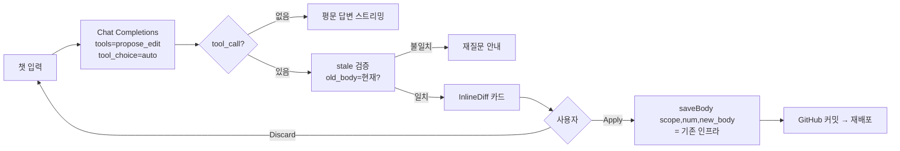

# Inspection Mode

## 이 스킬의 목적

React 프로토타입 화면에 두 가지 기능을 주입한다.

1. **DescTooltip + 정책 인덱스 패널** — 설명 모드 ON 시 컴포넌트를 마우스 우클릭하면 클릭 위치에 비즈니스 로직·계산 수식·유효성 검증·예외 처리·상태 분기가 툴팁으로 표시된다. 동시에 우측 사이드에 작성된 정책들의 **정책 인덱스 패널**(필수)이 표시되어 목록 → 화면으로 탐색할 수 있다(Phase 5-c).
2. **챗봇** (디폴트 활성) — 개발자·디자이너가 화면을 보면서 PRD·디스크립션·코드를 근거로 질문하면 근거 섹션 인용(`[§id]`)과 함께 답한다. 텍스트 수정 요청 시 Diff + 컨펌 패치로 반영된다(기존 desc 편집 인프라 재사용).

두 기능은 독립 토글. 챗봇 비활성화 선택 시 DescTooltip만 동작한다.

작업 컨텍스트(슬러그·리서치·디자인 시스템 경로)는 `context.json`으로 결정한다. 자동 감지 없음.

---

## Phase 0 — 착수 전 확인

의뢰가 들어오면 아래를 확인한다. 모호하면 ⚠️ 가정 명시 후 진행.

1. **작업 디렉토리 경로**: `./prd-flow/{slug}/` 형태의 작업 디렉토리가 있는지 확인.
2. **PRD 출처**: 작업 디렉토리(우선) / Notion URL / PDF / 대화 중 직접 제공.
3. **프로토타입 위치**: React 소스 파일 경로 / 대화 중 코드 직접 제공.
4. **추가 대상 화면 범위**: 전체 화면 / 특정 화면만.
5. **기존 InspectionContext 존재 여부**: 있으면 재사용, 없으면 신규 생성.
6. **챗봇 모드 활성화 여부**:
   - "활성화": DescTooltip + 챗봇 패널 주입 (Phase 6~9 실행)
   - "비활성화": DescTooltip만 주입 (Phase 6~9 스킵)
   - 기본값: **활성화**
7. **챗봇 LLM 프로바이더와 실행 위치** (챗봇 활성 시):
   - 두 가지 중에서 고른다. **`local`** = 자체 호스팅 LLM 서버(OpenAI 호환 엔드포인트를 제공하는 vLLM·Ollama 등), **`api`** = 상용 LLM API. 둘 다 요청 스키마가 같아 코드는 하나이고 base URL·키·모델명만 갈린다.
   - `local`은 PRD·정책·desc 전문이 외부로 나가지 않고 호출 비용도 없지만, **LLM 서버가 있는 네트워크 안에서만** 도달한다. 사용자에게 **누가 어디서 이 프로토타입을 열 것인지**를 확인하고 아래로 결정한다.

   | 열람 위치 | 프로바이더 | 프로토타입 실행 방식 |
   |---|---|---|
   | 작성자 본인 (LLM 서버와 같은 네트워크) | `local` | `npm run dev` + Vite dev proxy |
   | 내부망 팀원 여러 명 | `local` | 내부망 주소로 호스팅(프록시 동봉) |
   | 사외(클라이언트·외부 검토자) | `api` | 기존 Vercel 배포 그대로 |

   - 자체 호스팅 서버가 사설 IP에 떠 있으면 **외부 클라우드(Vercel) 배포본에서는 도달할 수 없다** — 이 조합은 챗봇이 응답하지 못한다.
   - 조직 내부 서버의 실제 주소·모델 목록·운영 절차는 `references/local-llm.local.md`(있으면)에서 읽는다. **이 파일은 git 배포 제외 대상**이므로 그 내용을 SKILL.md·chatbot-architecture.md 등 다른 스킬 파일로 옮겨 적지 않는다. 파일이 없으면 사용자에게 서버 정보를 확인하거나 `api`로 진행한다.
   - 상세 제약과 코드는 [chatbot-architecture.md](references/chatbot-architecture.md) §0·§1·§5-b.

---

## Phase 1 — 컨텍스트 적재

### 1-1. context.json 확인

작업 디렉토리 루트에서 `context.json`을 읽는다.

**context.json 있는 경우:**
```json
{
  "feature_slug": "...",
  "research_dir": "research/",
  "design_system": "design/design-system.md",
  "ux_writing_skill": "general-ux-writing",
  "notion_upload": false,
  "created_at": "..."
}
```
→ 이 파일이 작업 컨텍스트 SoT. 호출 인자보다 context.json 우선.

**context.json 없는 경우:**
→ "작업 디렉토리의 context.json이 없습니다." 안내 후 임시 context.json 작성하거나 prd-builder-discovery 라우팅 권장.

### 1-2. 컨텍스트 적재

| 적재 대상 | 출처 |
|---|---|
| 디자인 톤 | `prd-flow/{slug}/design/design-system.md` (design-system-builder 생성물) |
| UX Writing | `general-ux-writing` 스킬 |
| 도메인 지식 | `prd-flow/{slug}/research/domain-*.md` 캐시 (관련 토픽만 적재, 최대 4개) |
| PRD 파일 | 작업 디렉토리 `gate1/`, `gate1.5/`, `auto-backward/` 파일 순차 읽기 → 없으면 직접 제공 fallback |

- 도메인 리서치 캐시는 확정 사양이 아니라 **참고 근거**다. 리서치 값을 단정하지 않고 출처를 병기하며, 사용자 제공 지식이 최우선이다. 캐시가 없고 도메인 지식이 필요하면 `domain-research` 스킬 실행을 권장한다.
- `design/design-system.md`가 없으면 `design-system-builder` 실행을 권장하고, 없는 상태로는 프로토타입 기존 스타일을 따른다.

**Fallback**: PRD 미제출 → "⚠️ PRD 미제출 모드. 확인 불가 항목은 `*` 인라인 노트로 표기" 안내 후 프로토타입 코드 기반 진행.

---

## Phase 2 — 프로토타입 분석

프로토타입 소스 코드를 읽어 아래를 추출한다.

1. **컴포넌트 트리**: 화면을 구성하는 컴포넌트 계층 목록
2. **상태(state) 분기**: `useState`, `if/else`, 삼항 연산자 기반의 조건부 렌더링 경로
3. **이벤트 핸들러**: `onClick`, `onChange`, `onSubmit` 등 인터랙션 트리거와 그 결과
4. **데이터 바인딩**: props, API 호출, 필터·정렬 로직
5. **권한 분기**: 역할별 표시/숨김 조건

이 결과를 토대로 Phase 5에서 desc 내용을 작성한다.

---

## Phase 2.5 — 정책 리서치 (트리거 조건 충족 시)

Phase 2 분석 결과에서 아래 조건 중 하나 이상 해당하면 실행한다. 미해당 시 "정책 리서치 스킵" 1줄 출력 후 Phase 3으로 진행.

**트리거 조건**
- 알고리즘·수식이 포함된 컴포넌트 감지 (추천 점수, 요금·정산 계산, 우선순위 가중치, 구독 일할 계산 등)
- L-n으로 분리될 cross-cutting 로직의 기술 상세가 PRD에 불명확
- PRD `*` 미확정 항목 중 업계 표준 참고로 구체화 가능한 것

**검색 내용**
- 알고리즘·계산 방식: 기술 블로그·논문 (예: `"subscription proration calculation patterns"`)
- 유사 기능 UX 처리 방식 (예: `"partial refund request UX patterns"`)

**적용 방식**
- L-n 정책 본문의 단계별 prose 작성에 반영
- PRD `*` 미확정 항목을 검색 기반 권고안으로 전환하거나 구체화
- 검색 결과 원문 적재 금지 — 요약만 컨텍스트에 유지

---

## Phase 3 — 구현 패턴 (기반 코드)

> **참조 구현**: 아래 코드 블록이 표준 참조 구현이다. 변경 시 이 스킬을 함께 업데이트한다.

> ⚠️ **DescTooltip·InspectionContext는 여기 기본형(desc prop 직접 전달, 정적)이지만, [Phase 5-e](#phase-5-e--desc-직접-편집--자동-배포-필수)가 필수이므로 실제로는 `references/desc-editing.md`의 SoT+편집 버전으로 대체해 구현한다.** 아래 기본형은 구조 이해용으로 남겨둔다.

### 3-1. InspectionContext — 전역 상태

Plain JavaScript (.jsx) 기준. TypeScript 환경이면 타입 어노테이션만 추가한다.

```jsx
// components/InspectionContext.jsx
import React, { createContext, useContext, useState } from 'react';

const InspectionContext = createContext({ active: false, toggle: () => {}, navigateTo: null });

export function InspectionProvider({ children, navigateTo }) {
  const [active, setActive] = useState(false);
  return (
    <InspectionContext.Provider value={{ active, toggle: () => setActive(p => !p), navigateTo: navigateTo || null }}>
      {children}
    </InspectionContext.Provider>
  );
}

export const useInspection = () => useContext(InspectionContext);
```

App 루트에 Provider + 토글 버튼 + PolicyIndexPanel 주입:

```jsx
// App.jsx (핵심 구조)
import { InspectionProvider, useInspection } from './components/InspectionContext';
import { PolicyIndexPanel } from './components/PolicyIndexPanel';

function InspectionToggle() {
  const { active, toggle } = useInspection();
  return (
    <button className={`insp-toggle${active ? ' active' : ''}`} onClick={toggle}>
      <span className="insp-toggle-dot" />
      {active ? '설명 모드 ON' : '설명 모드'}
    </button>
  );
}

function AppInner() {
  const [activeScreen, setActiveScreen] = useState('screen-01');
  // 패널은 floating card — 콘텐츠 paddingRight 불필요
  // InspectionToggle은 nav bar 우측 끝에 인라인 배치 (marginLeft: auto)
  return (
    <div style={{ display: 'flex', flexDirection: 'column', height: '100vh' }}>
      {/* 와이어프레임 내비게이터 — InspectionToggle은 여기 우측 끝에 */}
      <div style={{ display: 'flex', alignItems: 'center', gap: 8, padding: '8px 16px', flexShrink: 0 }}>
        {SCREENS.map(s => <button key={s.id} onClick={() => setActiveScreen(s.id)}>{s.label}</button>)}
        <div style={{ marginLeft: 'auto' }}>
          <InspectionToggle />
        </div>
      </div>
      {/* 화면 렌더 */}
      <div style={{ flex: 1, overflow: 'hidden' }}>
        <ActiveComponent />
      </div>
      <PolicyIndexPanel onNavigate={setActiveScreen} />
    </div>
  );
}

export default function App() {
  return <InspectionProvider><AppInner /></InspectionProvider>;
}
```

### 3-2. DescTooltip 컴포넌트

- **우클릭(onContextMenu)** → 클릭 위치에 다크 툴팁 고정 표시
- **배지 번호**: CSS `::before` 기반 — React span 렌더 없음. `data-num` 속성만 설정하면 CSS가 처리
- **DT_CLOSE_ALL 이벤트**: 동시에 하나만 열림 보장

```jsx
// components/DescTooltip.jsx
import React, { useState, useRef, useEffect } from 'react';
import { createPortal } from 'react-dom';
import { useInspection } from './InspectionContext';

const DT_CLOSE_ALL = 'dt:close-all';

export function DescTooltip({ desc, label, num, componentId, children }) {
  const { active } = useInspection();
  const [show, setShow] = useState(false);
  const [pos, setPos] = useState({ x: 0, y: 0 });
  const tooltipRef = useRef(null);

  useEffect(() => { if (!active) setShow(false); }, [active]);
  useEffect(() => {
    const handler = () => setShow(false);
    window.addEventListener(DT_CLOSE_ALL, handler);
    return () => window.removeEventListener(DT_CLOSE_ALL, handler);
  }, []);
  useEffect(() => {
    if (!show) return;
    const onOutside = (e) => {
      if (tooltipRef.current && !tooltipRef.current.contains(e.target)) setShow(false);
    };
    document.addEventListener('mousedown', onOutside, true);
    return () => document.removeEventListener('mousedown', onOutside, true);
  }, [show]);
  useEffect(() => {
    if (!show) return;
    const onKey = (e) => { if (e.key === 'Escape') setShow(false); };
    document.addEventListener('keydown', onKey);
    return () => document.removeEventListener('keydown', onKey);
  }, [show]);

  if (!active) return <>{children}</>;

  function handleContextMenu(e) {
    e.preventDefault();
    e.stopPropagation();
    const wasShown = show;
    window.dispatchEvent(new CustomEvent(DT_CLOSE_ALL));
    if (!wasShown) {
      // 툴팁 위치 결정 정책:
      //   width  380px 고정 — 우측 공간 부족 시 커서 왼쪽에 표시
      //   height max 60vh  — 하단 공간 부족(커서 아래 60vh 미확보) 시 커서 위에 표시
      const tooltipW = 380;
      const tooltipMaxH = Math.floor(window.innerHeight * 0.6);
      const x = e.clientX + tooltipW > window.innerWidth ? e.clientX - tooltipW : e.clientX;
      const y = e.clientY + 8 + tooltipMaxH > window.innerHeight ? e.clientY - tooltipMaxH : e.clientY + 8;
      setPos({ x, y });
      setShow(true);
    }
  }

  return (
    <div
      className={`dt-wrap${show ? ' dt-wrap--selected' : ''}`}
      data-comp-id={componentId}
      data-num={num || undefined}   // CSS ::before 로 배지 렌더 — span 없음
      onContextMenu={handleContextMenu}
    >
      {children}
      {show && createPortal(
        <div
          ref={tooltipRef}
          className="dt-box"
          style={{ left: pos.x, top: pos.y }}
          onClick={e => e.stopPropagation()}
        >
          {label && <div className="dt-label">{label}</div>}
          {/* 패널(DetailBody)과 동일한 hanging indent — 감싸인 줄이 항목 시작에 정렬 */}
          <div className="dt-body">
            {desc.split('\n').map((l, i) => {
              const { content, style } = descLineIndent(l);
              if (content === '') return <div key={i} style={{ height: 6 }} />;
              return <div key={i} style={style}>{content}</div>;
            })}
          </div>
        </div>,
        document.body
      )}
    </div>
  );
}
```

> `descLineIndent`는 DescTooltip과 PolicyIndexPanel이 공유한다(3-3 참조). 공용 유틸(`utils/descIndent.js` 등)로 빼서 두 곳에서 import 하는 것을 권장한다.

### 3-3. PolicyIndexPanel 컴포넌트

**핵심 동작**: 항목 클릭 → 패널 내 아코디언 인라인 확장 + 화면 이동·강조 동시 실행.

**데이터 구조**: `SCREEN_POLICIES`와 `LOGIC_POLICIES` 배열에 `body` 필드 포함. 이 배열이 정책 내용의 단일 진실 소스(SoT). DescTooltip의 `desc` prop과 내용이 일치해야 한다.

```jsx
// components/PolicyIndexPanel.jsx

// desc 한 줄의 선행 공백·리스트 마커("1. "·"- "·"· ")를 hanging indent 스타일로
// 환산한다. 마커 폭만큼 첫 줄을 당겨(textIndent 음수) 항목이 다음 줄로 감싸일(wrap)
// 때 그 줄도 항목 텍스트 시작 위치에 맞춰 정렬되게 한다.
// (선행 공백 보존 + pre-wrap 방식은 감싸인 줄이 좌측 끝으로 돌아가 깨져 보이므로 쓰지 않는다.)
function descLineIndent(rawLine) {
  const lead = (rawLine.match(/^ */)[0] || '').length;
  const content = rawLine.slice(lead);
  // 빈 줄과 헤더([...])는 들여쓰기 대상이 아니다
  if (content === '' || content.charAt(0) === '[') return { content, style: undefined };
  const marker = (content.match(/^(?:\d+\.|[-·])\s+/) || [''])[0];
  const indent = lead + marker.length;
  if (indent === 0) return { content, style: undefined };
  return { content, style: { paddingLeft: indent + 'ch', textIndent: '-' + marker.length + 'ch' } };
}

// 본문 렌더: [헤더] 줄은 ipd-h, 빈 줄은 ipd-sp, 일반 줄은 ipd-l(hanging indent)
// {L-n} 토큰은 클릭 가능한 참조 칩으로 변환
function DetailBody({ body, onLogicClick }) {
  if (!body) return null;
  return (
    <div>
      {body.split('\n').map((l, i) => {
        const { content, style } = descLineIndent(l);
        if (content === '') return <div key={i} className="ipd-sp" />;
        if (content.charAt(0) === '[') return <div key={i} className="ipd-h">{content}</div>;
        const parts = content.split(/(\{L-\d+\})/g);
        return (
          <div key={i} className="ipd-l" style={style}>
            {parts.map((p, j) => {
              const m = p.match(/^\{(L-\d+)\}$/);
              return m
                ? <button key={j} className="ipd-ref" onClick={() => onLogicClick(m[1])}>{m[1]}</button>
                : p;
            })}
          </div>
        );
      })}
    </div>
  );
}

const SCREEN_POLICIES = [
  // 각 항목: { num, group, screen, title, componentId, body }
  // body: 정책 전문. [헤더] 줄 → 볼드 헤더, 빈 줄 → 간격, 나머지 → 본문
  // {L-n} 토큰 → 로직 탭 참조 칩 (클릭 시 로직 탭으로 전환)
];

const LOGIC_POLICIES = [
  // 각 항목: { num, title, refId, refScreen, body }
  // refId: 화면에서 확인 → 버튼이 이동할 componentId
];

export function PolicyIndexPanel({ onNavigate }) {
  const { active } = useInspection();
  const [tab, setTab] = useState('screen');
  const [openKey, setOpenKey] = useState(null);

  if (!active) return null;

  function navigateTo(screen, componentId) {
    if (onNavigate) onNavigate(screen);
    setTimeout(() => {
      const el = document.querySelector(`[data-comp-id="${componentId}"]`);
      if (!el) return;
      el.scrollIntoView({ behavior: 'smooth', block: 'center' });
      el.classList.add('pol-pulse', 'dt-wrap--selected');
      setTimeout(() => el.classList.remove('pol-pulse', 'dt-wrap--selected'), 1300);
    }, 80);
  }

  function handleScreenClick(policy) {
    setOpenKey(openKey === policy.componentId ? null : policy.componentId);
    navigateTo(policy.screen, policy.componentId);
  }

  function handleLogicClick(policy) {
    setOpenKey(openKey === policy.num ? null : policy.num);
    if (policy.refId) navigateTo(policy.refScreen, policy.refId);
  }

  function handleLogicRefChip(logicNum) {
    const lg = LOGIC_POLICIES.find(l => l.num === logicNum);
    if (!lg) return;
    setTab('logic');
    setOpenKey(lg.num);
    if (lg.refId) navigateTo(lg.refScreen, lg.refId);
  }

  const isSub = (num) => /[a-z]$/.test(num);
  const GROUPS = [...new Set(SCREEN_POLICIES.map(p => p.group))];

  return (
    <div className="insp-panel">
      <div className="ip-head">
        <span className="ip-title">정책 인덱스</span>
        <span className="ip-count">{tab === 'screen' ? SCREEN_POLICIES.length : LOGIC_POLICIES.length}개</span>
      </div>
      <div className="ip-tabs">
        <button className={`ip-tab${tab === 'screen' ? ' is-active' : ''}`}
          onClick={() => { setTab('screen'); setOpenKey(null); }}>화면</button>
        <button className={`ip-tab${tab === 'logic' ? ' is-active' : ''}`}
          onClick={() => { setTab('logic'); setOpenKey(null); }}>로직·계산식</button>
      </div>

      {tab === 'screen' && GROUPS.map(group => (
        <div key={group}>
          <div className="ip-group">{group}</div>
          {SCREEN_POLICIES.filter(p => p.group === group).map(policy => (
            <div key={policy.componentId}
              className={`ip-row${isSub(policy.num) ? ' ip-row--sub' : ''}${openKey === policy.componentId ? ' open' : ''}`}>
              <button className="ip-item" onClick={() => handleScreenClick(policy)}>
                <span className="ip-num">{policy.num}</span>
                <span className="ip-label">{policy.title}</span>
                <span className="ip-chev">›</span>
              </button>
              <div className="ip-detail">
                <DetailBody body={policy.body} onLogicClick={handleLogicRefChip} />
              </div>
            </div>
          ))}
        </div>
      ))}

      {tab === 'logic' && (
        <div>
          <div className="ip-group">로직·계산식 (cross-cutting)</div>
          {LOGIC_POLICIES.map(policy => (
            <div key={policy.num}
              className={`ip-row${openKey === policy.num ? ' open' : ''}`}>
              <button className="ip-item" onClick={() => handleLogicClick(policy)}>
                <span className="ip-num">{policy.num}</span>
                <span className="ip-label">{policy.title}</span>
                <span className="ip-chev">›</span>
              </button>
              <div className="ip-detail">
                <DetailBody body={policy.body} onLogicClick={handleLogicRefChip} />
                {policy.refId && (
                  <button className="insp-ref-btn"
                    onClick={() => navigateTo(policy.refScreen, policy.refId)}>
                    화면에서 확인 →
                  </button>
                )}
              </div>
            </div>
          ))}
        </div>
      )}
    </div>
  );
}
```

### 3-4. CSS (wireframe.css 또는 globals.css)

```css
/* 설명 모드 토글 버튼 — nav bar 우측 끝에 인라인 배치 (position: fixed 없음) */
.insp-toggle {
  display: flex; align-items: center; gap: 6px;
  background: #fff;
  border: 1.5px solid rgba(112,115,124,0.32);
  border-radius: 20px; padding: 5px 12px;
  font-size: 12px; font-weight: 600; color: #70737c;
  cursor: pointer;
  box-shadow: 0 1px 4px rgba(0,0,0,0.08);
  transition: background 0.15s, border-color 0.15s, color 0.15s;
  user-select: none; white-space: nowrap;
}
.insp-toggle:hover { background: #f0f2ff; }
.insp-toggle.active { background: #4a71ff; border-color: #4a71ff; color: #fff; }
.insp-toggle-dot {
  width: 7px; height: 7px; border-radius: 50%;
  background: currentColor; opacity: 0.7; flex-shrink: 0;
}
.insp-toggle.active .insp-toggle-dot { opacity: 1; animation: insp-dot-blink 1.4s infinite; }
@keyframes insp-dot-blink { 0%, 100% { opacity: 1; } 50% { opacity: 0.3; } }

/* DescTooltip 래퍼 */
/* 기본 상태: outline과 배지 50% opacity — 콘텐츠 가독성 보호 */
.dt-wrap {
  position: relative;
  outline: 2px dashed rgba(74,113,255,0.28);
  outline-offset: 2px; border-radius: 6px; cursor: context-menu;
  transition: outline-color 0.15s;
}
/* 호버 시 outline 100% */
.dt-wrap:hover { outline-color: rgba(74,113,255,0.55); outline-style: solid; }
.dt-wrap:hover::before { opacity: 1; }
/* 툴팁 활성(선택) 시 100% */
.dt-wrap--selected {
  outline: 2px solid #4a71ff;
  animation: dt-pulse 1.4s ease-in-out infinite;
}
.dt-wrap--selected::before { opacity: 1; }
@keyframes dt-pulse {
  0%, 100% { box-shadow: 0 0 0 3px rgba(74,113,255,0.35); }
  50%       { box-shadow: 0 0 0 7px rgba(74,113,255,0.08); }
}

/* 번호 배지 — data-num 속성 기반 CSS ::before (React span 없음) */
.dt-wrap[data-num]::before {
  content: "[" attr(data-num) "]";
  position: absolute; top: 0; left: 0; z-index: 10;
  background: #4a71ff; color: #fff;
  font-size: 10px; font-weight: 700; line-height: 1.5; letter-spacing: .3px;
  padding: 1px 6px; border-radius: 4px 0 4px 0;
  pointer-events: none;
  opacity: 0.5; transition: opacity 0.15s;   /* 기본 50%, 호버/활성 시 100% */
}

/* 우클릭 툴팁 박스
   - max-height: 60vh + overflow-y: auto — 긴 desc가 화면을 넘지 않도록 스크롤 제한
   - position 결정 로직(handleContextMenu)과 함께 동작:
       x: 우측 공간 부족 시 커서 왼쪽에 표시
       y: 하단 공간 부족 시 커서 위에 표시 (커서 위 60vh 확보 여부로 판단)
*/
.dt-box {
  position: fixed; z-index: 9999;
  width: 380px; max-width: calc(100vw - 24px);
  max-height: 60vh; overflow-y: auto;
  background: #1c1f2e; color: #e2e6f0;
  border-radius: 10px; padding: 14px 16px;
  box-shadow: 0 8px 28px rgba(0,0,0,0.40);
}
.dt-label { font-size: 11.5px; font-weight: 700; color: #7da4f8; letter-spacing: .3px; margin-bottom: 8px; }
.dt-body { font-size: 12.5px; line-height: 1.65; color: #d6dbe8; white-space: pre-wrap; }   /* 들여쓰기는 descLineIndent가 padding/textIndent로 처리(선행 공백 아님) */

/* ─── 정책 인덱스 패널 (floating card) ─── */
.insp-panel {
  position: fixed; top: 56px; right: 16px; z-index: 1050;
  max-width: calc(100vw - 32px);   /* 너비는 인라인 style(드래그 조절)로 제어 */
  max-height: calc(100dvh - 72px); overflow-y: auto;
  background: #fff;
  border: 1px solid rgba(112,115,124,0.20);
  border-radius: 12px;
  box-shadow: 0 8px 28px rgba(0,0,0,0.12);
  padding: 14px;
}
/* 좌측 너비 조절 핸들 — 회색 영역 + ‹ 화살표로 드래그 가능함을 명확히 표시.
   핸들 폭(16px)만큼 .insp-panel의 padding-left를 늘려 콘텐츠와 겹치지 않게 한다. */
.insp-resize {
  position: absolute; left: 0; top: 0; bottom: 0; width: 16px;
  cursor: ew-resize; border-radius: 12px 0 0 12px;
  display: flex; align-items: center; justify-content: center;
  background: var(--semantic-natural-default, #eaebec);
  transition: background 0.15s;
}
.insp-resize::before {
  content: '‹';
  font-size: 16px; font-weight: 700; line-height: 1;
  color: var(--semantic-text-sub, #70737c);
}
.insp-resize:hover { background: rgba(74,113,255,0.18); }
.insp-resize:hover::before { color: var(--semantic-primary-default, #4a71ff); }
.ip-head { display: flex; align-items: center; gap: 8px; margin-bottom: 6px; }
.ip-title { font-size: 14px; font-weight: 700; color: #171719; }
.ip-count { font-size: 12px; font-weight: 600; color: #4a71ff; background: rgba(74,113,255,0.10); border-radius: 999px; padding: 1px 8px; }
.ip-tabs { display: flex; gap: 4px; margin: 4px 0 8px; }
.ip-tab { flex: 1; padding: 5px 8px; border-radius: 7px; font-size: 12px; font-weight: 600; color: #70737c; background: rgba(112,115,124,0.08); cursor: pointer; border: none; font-family: inherit; }
.ip-tab.is-active { background: #4a71ff; color: #fff; }
.ip-group { font-size: 11.5px; font-weight: 700; color: #70737c; margin: 12px 0 2px; }
.ip-item { width: 100%; display: flex; align-items: center; gap: 8px; background: none; border: none; padding: 7px 8px; border-radius: 8px; cursor: pointer; text-align: left; font-family: inherit; }
.ip-item:hover { background: rgba(74,113,255,0.06); }
.ip-num { font-size: 11px; font-weight: 700; color: #fff; background: #4a71ff; border-radius: 5px; padding: 2px 6px; flex-shrink: 0; }
.ip-label { flex: 1; font-size: 14px; color: #171719; }   /* 기본 본문 텍스트 14px */
.ip-chev { color: #70737c; font-size: 15px; transition: transform .15s; flex-shrink: 0; }
.ip-row.open .ip-chev { transform: rotate(90deg); color: #4a71ff; }
.ip-detail { display: none; padding: 4px 10px 12px; }
.ip-row.open .ip-detail { display: block; }
.ipd-h { font-size: 14px; font-weight: 700; color: #171719; margin: 9px 0 3px; }   /* 소제목도 기본 14px */
.ipd-l { font-size: 14px; line-height: 1.55; color: #70737c; white-space: pre-wrap; }   /* 기본 본문 14px · 들여쓰기는 descLineIndent(hanging indent)로 처리 */
.ipd-sp { height: 6px; }
.ip-row--sub .ip-item { padding-left: 22px; }
.ip-row--sub .ip-num { background: rgba(74,113,255,0.45); }
.ip-row--sub .ip-label { color: #70737c; font-size: 12.5px; }
.ipd-ref { display: inline-flex; align-items: center; padding: 0 6px; margin: 0 2px; background: #4a71ff; color: #fff; font-size: 11px; font-weight: 700; line-height: 1.6; border: none; border-radius: 999px; cursor: pointer; vertical-align: baseline; font-family: inherit; }
.ipd-ref:hover { opacity: .85; }
.insp-ref-btn { display: inline-block; margin-top: 8px; padding: 4px 10px; background: rgba(74,113,255,0.12); border: 1px solid rgba(74,113,255,0.30); border-radius: 4px; font-size: 11px; color: #4a71ff; cursor: pointer; font-family: inherit; }
.insp-ref-btn:hover { background: rgba(74,113,255,0.22); }

/* 패널 항목 클릭 → 화면 컴포넌트 강조 */
@keyframes polPulse {
  0%   { box-shadow: inset 0 0 0 9999px rgba(74,113,255,.28); }
  100% { box-shadow: inset 0 0 0 9999px rgba(74,113,255,.00); }
}
.pol-pulse { animation: polPulse 1.2s ease-out 1; border-radius: 6px; }
```

### 3-5. PolicyIndexPanel SCREEN_POLICIES 작성 규칙

SCREEN_POLICIES는 **정책 내용의 단일 진실 소스(SoT)**다. 화면 파일(.jsx)의 DescTooltip `desc` prop과 동기화해 관리한다.

```
각 항목 필수 필드:
  num        — 정책 번호 (예: "1-1", "1-1a", "L-1")
  group      — 화면 그룹 이름 (panel 내 섹션 헤더)
  screen     — 화면 id (App.jsx SCREENS 배열과 일치)
  title      — 항목 이름 (짧게, 15자 이내 권장)
  componentId — DescTooltip의 componentId와 동일값
  body       — 정책 전문 (멀티라인 템플릿 리터럴)

body 작성 규칙:
  · [헤더]로 시작하는 줄 → 볼드 헤더 (ipd-h)
  · 빈 줄 → 간격 (ipd-sp)
  · 나머지 → 본문 (ipd-l)
  · 개조식 들여쓰기: 단계당 공백 2칸 + 리스트 마커("1. "·"- "·"· ")로 쓴다.
    렌더러(descLineIndent)가 선행 공백·마커를 hanging indent로 환산하므로,
    항목이 길어져 다음 줄로 감싸일(wrap) 때 그 줄도 항목 텍스트 시작에 맞춰 정렬된다.
    (선행 공백을 그대로 pre-wrap으로 보존하면 감싸인 줄이 좌측 끝으로 돌아가 깨져 보인다 — 쓰지 않는다.)
  · {L-n} 토큰 → 로직 탭 참조 칩 (클릭 시 로직 탭 이동)
  · 화살표(→) 사용 기준: 값-결과 매핑에만 허용. 인과·순서 서술은 서술어로 완결.
```

---

## Phase 4 — DescTooltip 적용 단위

### 적용 O (의미 단위)
- 통계 카드 그룹 전체
- 개별 목록 행/카드
- 탭 바 전체
- 위젯 (헤더 포함)
- 캘린더·보드 등 뷰 구역
- 액션 버튼 그룹
- 상태 전환 분기별 패널

### 적용 X (너무 크거나 너무 작음)
- 페이지 전체
- 단순 텍스트 레이블 1개
- 버튼 1개 (그룹이 아닌 단독)
- 아이콘, 구분선

### 중첩(nested) DescTooltip 허용
외부 영역 + 내부 세부 컴포넌트에 각각 감싸는 것은 허용. 우클릭 시 `DT_CLOSE_ALL` 이벤트가 전파되어 기존 툴팁이 닫히고, `stopPropagation`으로 가장 안쪽 요소의 툴팁이 우선 열린다.

### 코드 패턴

```tsx
// 단일 라인 설명
<DescTooltip label="컴포넌트명" componentId="ComponentName" desc={`설명 내용`}>
  <div className="widget">...</div>
</DescTooltip>

// 복수 섹션 — [섹션명] 구분 + \n\n으로 단락 분리
<DescTooltip
  label="미처리 문의 목록 위젯"
  componentId="PendingInquiryList"
  desc={`[정렬 기준]\n1순위: 처리 지연 최우선\n2순위: 우선순위 높음 → 중간 → 낮음\n\n[갱신 주기]\n웹소켓 또는 30초 폴링 갱신.`}
>
  <div className="panel">...</div>
</DescTooltip>
```

`componentId`는 챗봇 Phase 8에서 "이것에 대해 물어보기" 버튼의 포커스 대상(`setFocusedNum`)으로 사용된다. manifest.json의 컴포넌트 id와 일치시킨다.

---

## Phase 4.5 — PRD 재주입 (Phase 5 직전)

Phase 2~4 코드 분석 과정에서 Phase 1에 적재된 PRD 컨텍스트가 희석된다. Phase 5 desc 작성 전에 PRD 핵심 내용을 재주입한다.

**재읽기 대상**
- `gate1/01-problem.md` — 핵심 사용자 흐름·문제 정의
- `gate1.5/06-solution-scope.md` — V1 기능 범위
- `auto-backward/07-features.md` — 화면별 기능 단위
- 위 파일이 없는 경우: 작업 디렉토리 내 PRD 파일 전체 재읽기

**목적**: Phase 5 desc 작성 시 PRD 기반 비즈니스 로직·정책 판단의 정확도를 유지한다.

---

## Phase 5 — desc 내용 작성 정책

### 핵심 원칙: 화면에서 보이는 것은 쓰지 않는다

desc는 와이어프레임을 봐서 이미 알 수 있는 정보를 반복하지 않는다. **보이지 않는 정책과 로직**만 기술한다.

**절대 기술하지 않는 것 — 3개 범주:**

**① 화면에서 이미 보이는 것 (프로토타입 중복)**
- 고정 텍스트·라벨·버튼 문구
- 레이아웃·배치 설명 ("좌측에 아이콘", "2열 그리드")
- 시각적 색상·크기 표현 ("빨간색 배지로 표시")
- 와이어프레임을 보면 바로 알 수 있는 UI 구조

**② PRD 영역 (기능의 Why·What)**
- 이 기능이 왜 만들어졌는지 (배경·기획 의도·비즈니스 목적)
- 문제 정의, 사용자 Pain Point
- 기능의 전체 범위(Scope) 설명
- KPI·성공 지표

**③ 티켓·개발자 영역 (구현의 How)**
- 개발 구현 방법, 기술 스택 선택
- 이 컴포넌트를 구현하기 위한 선행 작업·의존성
- API 엔드포인트, DB 스키마, 라이브러리 사용 방식
- 개발 단위 분해 (이건 티켓에서 정의)

### desc 문장 작성 규칙

**서술형·개조식 적절 혼합 + 간결 (editorial-reviewer 가독성 정책 준수)**
자세히 쓰되 불필요한 설명을 늘어놓지 않는다. 서술형과 개조식을 목적에 맞게 섞는다.
- **형식 선택**: 나열·병렬 항목(파라미터·조건·단계)은 개조식(`·`/번호)으로, 인과·흐름은 짧은 서술문으로 쓴다. 한 섹션을 전부 긴 서술문으로만 몰거나 전부 단편 개조식으로만 몰지 않는다.
- **한 호흡 문장**: 한 문장에 두 사실 이상을 접속사로 길게 잇지 않는다. 끊어 쓴다.
- **불필요한 부연 제거**: 독자가 이미 아는 일반 전제("검색은 입력한 키워드로 결과를 좁힌다" 같은 상식적 서술)나 같은 말 반복은 뺀다. 핵심 정의·수치·조건만 남긴다.
- **복잡한 처리 개념은 입력·출력 구조로 압축**: 장황한 설명 대신 `입력: 원본 목록 / 출력: 필터·정렬된 결과` 식으로 개조식 압축.
- **위계 형식 일관**: 같은 위계 항목은 같은 형식으로(명사형 "~의 구성"과 서술형 "~을 구성한다" 혼재 금지).

**중복 서술 금지 (특히 L-n 로직 항목)**
같은 내용을 다른 표현으로 반복하지 않는다. 로직·계산식 항목은 섹션이 많아 중복이 쌓이기 쉬우므로 아래를 지킨다.
- **유추 가능 문장 삭제**: 앞 문장/섹션에서 이미 드러난 사실을 다시 단정하지 않는다. 예: "요청은 접수 후 담당자에게 배정된다"가 있으면 "담당자가 없는 요청은 아직 배정 전 상태다"는 별도 서술은 유추되므로 삭제.
- **같은 말 다른 표현 통합**: 긍정형("본인이 등록한 항목에만 편집 버튼을 표시한다")과 부정형("타인이 등록한 항목에는 편집 버튼을 표시하지 않는다")처럼 동일 정책을 두 번 쓰지 않는다. 한 문장으로 합치고, 예외 대상은 뒤에 묶는다.
- **상단 요약과 하위 항목 중복 제거**: 섹션 도입 문장이 하위 개조식 항목과 같은 내용이면 도입 문장을 뺀다(예: "실패 건은 이전 값을 유지" 도입 + 하위 "자동 복원: …이전 값 유지" → 도입 삭제).
- 판정 기준: 문장을 지웠을 때 독자가 **다른 문장에서 그 사실을 알 수 있으면** 그 문장은 중복이다.

**화살표(`→`) 사용 기준**
- 허용: 값-결과 매핑 표처럼 시각적 대응 관계를 나타낼 때. 예: `1시간 미만 → "N분 전"`, `연체 3회 이상 → 이용 일시 정지`
- 금지 ①: 인과·순서를 서술하는 문장 안에서 동사를 대체하는 용도. "클릭 시 상태가 전환된다."처럼 서술어로 완결한다.
- 금지 ②: 로직 항목 크로스 링크 용도. `트리거. → L-4` ❌ — DescTooltip `desc`에서는 서술 문장으로 표기, PolicyIndexPanel `body`에서는 `{L-n}` 토큰 단독 사용.

**L-n 크로스 링크 형식 (DescTooltip desc vs PolicyIndexPanel body)**

| 위치 | 올바른 형식 | 금지 형식 |
|---|---|---|
| DescTooltip `desc` | `피드백 수집 로직의 트리거. (정책 인덱스 로직 탭 L-4)` | `트리거. → L-4` |
| DescTooltip `desc` 섹션 헤더 | `[할인율 산출 (로직 탭 L-2)]` | `[할인율 산출] → L-2` |
| PolicyIndexPanel `body` | `피드백 수집 로직의 트리거. {L-4}` | `트리거. → {L-4}` |
| PolicyIndexPanel `body` 헤더 줄 | 헤더 줄(`[...]`)에 `{L-n}` 포함 금지 — 렌더 안 됨. 헤더 다음 줄에 `산출 방식: {L-1}` | `[우선순위 점수 산출 방식] → {L-1}` |

**영문 표기 규칙**

한국어 문장 내 영문 단어를 그대로 쓰지 않는다.
- 허용 예외: `AI`, `ML`, `LLM`, `API`, `KPI`, `PRD`, `SaaS`, `DB`, `CSV`, `URL` 등 통용 약어
- 금지 예시: `delta 값` ❌ → `편차량` ✅ / `prefill` ❌ → `자동 입력` 또는 `자동 선택 상태로 표시` ✅
- 상태값·열거형(enum) 영문 식별자는 괄호 안 병기 포함 **완전 금지**. `확인 대기(proposed)` ❌ → `확인 대기` ✅

**내부 코드 앵커링 (PRD·티켓 동기화)**

`F-XX`, `X-XX` 형태의 내부 코드는 desc 문자열에 넣지 않는다. 검토자 화면에 노출되면 혼란을 주고, 코드 변경 시 desc를 직접 수정해야 하는 유지보수 부채가 생긴다. 대신 desc 상수 바로 위 JS 주석으로 앵커링한다.

```js
/* PRD·티켓 앵커 (화면 미노출):
   파이프라인 F-05 | 단계: X-05 → X-01 → X-03 → X-06 → X-07 */
const DESC_SUMMARY_BUTTON = `[버튼 상태 분기]
· 준비 완료 (현재): "AI 주간 요약 보기" — 요약 생성 완료, 클릭 시 요약 결과 모달 진입.
· 생성 중: "생성 중" 표시 + 비활성 — 요약 파이프라인 처리 중 (목표: 30초 이내).
...`;
```

- 앵커 주석 포맷: `/* PRD·티켓 앵커 (화면 미노출): ... */`
- desc 내 단계 설명은 코드 제거 후 한국어 동작 서술만 남긴다.
- 검색·grep으로 코드를 찾을 수 있으므로 PRD·티켓과 동기화 목적은 유지된다.

**`=` 기호 사용 기준**

| 용도 | 가부 | 대체 형식 |
|---|---|---|
| 수식·계산 공식 | ✅ 허용 | `할인 적용 금액 ÷ 정가 = 할인율` |
| 변수 정의 (glossary형) | ❌ 금지 | `달성률 = 목표 대비...` ❌ → `달성률: 목표 대비...` ✅ |
| 서술형 정의 | ❌ 금지 | `"처리 지연" = 자동 전환 상태` ❌ → `'처리 지연'은 제한 시간 초과 시 자동 전환되는 상태 레이블이다.` ✅ |

**다항목 동작은 개조식으로 분리**
한 인터랙션에서 2개 이상의 동작이 발생하면 `+`로 연결하지 않고 개조식 목록으로 나열한다.

```
❌ '상담 시작' 클릭 시 → 상태 proposed → inprog 전환 + 담당자 자동 배정(선착순 1인) + 처리 내역 기록 화면으로 즉시 이동.

✅ '상담 시작' 클릭 시 아래 세 가지가 순서대로 실행된다.
  - 문의 처리 상태가 접수 대기에서 처리 중으로 전환된다.
  - 담당자가 선착순 1인으로 자동 배정된다.
  - 처리 내역 기록 화면으로 즉시 이동한다.
```

**표면 형태 스캔 (작성 완료 후 필수 점검)**

desc 작성 완료 후 아래 항목을 텍스트 스캔으로 확인한다. 하나라도 해당하면 수정 후 재검토.

```
□ `→`가 있는 모든 줄 — 값-결과 매핑(허용) 외 용도인지 확인
□ 영문 소문자 단어 — 허용 목록(AI, ML, LLM, API 등 통용 약어) 외 단어가 있는지 확인
□ 상태값 괄호 내 영문 — `(proposed)` `(inprog)` 등 영문 코드 병기 여부 확인
□ 서술 목적의 `=` — 수식이 아닌 정의·변수 설명에 `=` 사용 여부 확인 → `:`로 교체
□ DescTooltip `desc`의 `→ L-n` 패턴 — `(정책 인덱스 로직 탭 L-n)` 형태로 교체
□ PolicyIndexPanel `body` 헤더 줄의 `{L-n}` — 헤더가 아닌 별도 줄로 이동
□ 내부 코드 패턴 (`F-XX`, `X-XX`, `B-XX` 등) — desc 문자열에 포함 여부 확인 → desc 상수 위 JS 주석으로 이동
□ 3단계 이상 순서형 처리 목록 — desc 내 단계 목록이 있는지 확인 → L-n으로 분리 후 desc에서 참조
□ AI 생성 텍스트 표시 컴포넌트 — desc에 [AI 생성 텍스트 구성] 섹션이 있고 핵심 변화 서술·추론 과정·다음 행동 제안 3가지 구성 요소가 명시되어 있는지 확인
□ 중복 서술 — 로직(L-n) 항목 중심으로, 앞 문장에서 유추 가능하거나 긍정형·부정형으로 같은 정책을 두 번 쓰거나 도입 문장이 하위 항목과 겹치는 문장이 있는지 확인 → 삭제·통합
```

### 섹션 헤더(소제목) 네이밍 규칙

desc 본문은 `[섹션명]` 헤더로 단락을 나눈다(`detailHtml`이 `[`로 시작하는 줄을 헤더로 렌더). 헤더는 **정책 축만 적지 말고, 그 정책의 대상까지 구체적으로** 적어 헤더만 읽어도 "무엇에 대한 어떤 정책인지" 드러나게 한다.

| 정책 축 | ✗ 모호 (축만) | ✓ 구체 (대상 + 축) |
|---|---|---|
| 표시 조건 | `[표시 조건]` | `['처리 내역 검토하기' 버튼 표시 조건]` |
| 유효성 검증 | `[유효성 검증]` | `[비밀번호 유효성 검증]` |
| 활성화 조건 | `[활성화 조건]` | `[정산 요청 버튼 활성화 조건]` |
| 계산식 | `[점수 산출]` | `[추천 우선순위 점수 산출]` |
| 상태 분기 | `[상태]` | `[문의 처리 단계 — 전체 상태]` |
| 정렬·그룹핑 | `[정렬 기준]` | `[태스크 목록 정렬 기준]` |
| 권한 | `[권한]` | `[멤버 초대 권한]` |
| 빈 상태 | `[빈 데이터]` | `[태스크 0건 시 표시]` |

**소제목 점검 3문장** — 헤더 작성 후 확인:
1. 헤더만 보고 **무엇에 대한** 어떤 정책인지 짐작되는가? (대상 + 정책 축)
2. 헤더가 화면에 보이는 라벨·문구를 그대로 반복하고 있지 않은가?
3. 그 섹션이 **PRD와 직접 관련된 기능**에 대한 내용인가? 아니면 삭제한다.

### 컴포넌트 섹션 정의 + 표시 정보 세분 넘버링

**① 섹션 정의 (맨 위 평문)**
각 컴포넌트(`[n-n]`) 툴팁은 **맨 윗줄에 그 섹션이 무엇인지 한 문장 정의**를 둔다(헤더 `[...]` 없이 평문). 그 아래에 `[섹션 헤더]` 정책들을 잇는다.
예) `[1-1] 처리 내역 기록` → "문의 담당자가 고객 확인 후 어떤 문제가 있었고, 어떤 조치를 취했는지 기록하는 섹션. AI 추천 태그 또는 직접 입력으로 기록한다."

**② 표시 정보·인터랙션 요소 세분 넘버링 (`[n-na]`)**
컴포넌트 안의 **개별 표시 정보(카드·값·시각 등)와 인터랙션 요소(버튼·토글 등 클릭 시 동작이 있는 것)**는 하위 번호 `[n-na] [n-nb] …`로 각각 넘버링한다.
- **표시 정보** — "그 값이 무엇을 표시하는지 + 표시 형식"을 기술한다(단순 숫자라도 정의를 남긴다).
  - 예) `[3-1b] 총 주문 건수` → "선택한 기간에 누적된 주문의 총 합 표시. 취소 처리 주문 제외."
  - 예) `[3-1a] 최근 갱신 시간` → "가장 최근에 주문 데이터가 갱신된 시간 표시. 표시 형식: YYYY-MM-DD hh:mm"
- **인터랙션 요소** — 클릭·토글 시 어떤 동작이 일어나는지 기술한다.
  - 예) `[3-0a] 누적 주문 현황 보기 버튼` → "클릭 시 해당 기간의 누적 주문 현황·정산 요청 팝업이 표시된다."
  - 단, **단순 닫기·취소처럼 팝업/화면을 종료만 하는 일반 동작 버튼은 넘버링하지 않는다.**

번호 체계: `[그룹]-[순번]`(섹션) + 하위 문자(`a, b, …`)로 표시 정보·인터랙션 요소. 패널은 하위 항목을 섹션 아래 들여쓰기로 렌더하고, 각 컴포넌트·표시 정보·버튼 박스 좌상단에 해당 번호 배지를 띄운다(Phase 5-c).

> "표시 정보"는 **PRD와 직접 관련된 화면 요소**에 한정한다(점검 3문장 적용). 기능과 무관한 장식·고정 텍스트는 넘버링하지 않는다.

### 로직·계산식 인덱스 (인터페이스와 분리, 패널 별도 탭)

계산식·비즈니스 로직처럼 **특정 UI 컴포넌트에 매이지 않고 여러 화면에 걸치는 cross-cutting 정책**은 화면 넘버링에 섞지 않고 별도 축으로 분리한다. 정책 인덱스 패널에 "**화면 / 로직·계산식**" 탭을 두어 나눈다.
- 번호 접두 `L-1, L-2 …` (화면의 `n-n`과 구분).
- **화면 위치가 없으므로 점선 박스·우클릭·배지 없음** — 패널 전용. 항목 클릭 시 대표 컴포넌트(`ref`)로 이동·강조만 준다.
- 본문은 **단계별 prose**로 풀어 쓰되, **개발자가 디스크립션만 보고 구현할 수 있을 만큼 구체적으로** 작성한다(검색 범위·사전 집계 구조·단계별 계산·점수 구간·예외 처리). 수식은 말로 풀고 직관·예시를 덧붙인다. 개발 유닛 문서의 알고리즘 서술 방식을 따른다.
- 화면 컴포넌트 desc는 해당 로직을 `{L-1}` 토큰으로 **크로스 링크**한다 — 렌더 시 클릭 가능한 칩이 되어 로직 탭의 해당 항목으로 이동한다(`renderRefs`). 중복 서술은 로직 항목으로 단일화한다.
- 예) `L-1 추천 우선순위 점수 산출` / `L-2 쿠폰 적용 자격 판정` / `L-3 정산 요청 활성화 조건`.

**복수 처리 단계 파이프라인 → L-n 분리 원칙**

단계별로 순서가 있는 처리 파이프라인이 최종 UI 상태(버튼 표시 여부, 모달 데이터 준비 등)를 결정하는 경우, 파이프라인 정책은 반드시 `L-n`으로 분리한다. desc에서 단계 목록을 직접 나열하지 않는다.

분리 기준 — 아래 조건을 모두 충족할 때:
- 처리 단계가 3개 이상이고 각 단계가 이전 단계의 결과를 입력으로 사용한다.
- 최종 결과가 복수 UI 요소(버튼 표시·모달 데이터·피드백 저장 등)에 영향을 미친다.

desc 작성 방식: 파이프라인 처리 순서를 `(정책 인덱스 로직 탭 L-n)` 한 줄로 참조.
L-n 본문 작성 방식: 단계별 요구사항을 자연어로 상세 기술. 개발 단축어 금지. 허용 약어(AI·LLM·API 등)는 사용 가능.

```
❌ desc에 직접 나열: "[처리 파이프라인]\n1. 주문 항목별 환불 대상 분류\n2. 쿠폰·포인트 차감분 재계산\n..."
✅ desc 참조: "환불 금액 산정 파이프라인 처리 순서: (정책 인덱스 로직 탭 L-5)"
✅ L-n 본문: "[1단계: 환불 대상 항목 분류]\n부분 환불 주문은 배송 상태와 결제 수단에 따라..."
```

---

**AI 생성 텍스트 구성 요소 명시 원칙**

LLM이 생성한 자연어 텍스트를 표시하는 컴포넌트의 desc에는, 해당 텍스트가 담아야 하는 구성 요소를 `[AI 생성 텍스트 구성]` 섹션으로 명시한다.

구성 요소 3가지 (생성 순서와 동일):

| 구성 요소 | 내용 | 예시 문장 (AI 주간 업무 요약) |
|---|---|---|
| 핵심 변화 서술 | 집계 지표 중 기준 범위를 벗어난 항목들이 어떻게 변화했는지. 복수 지표가 겹치면 겹친 것부터 서술 | "완료 태스크 수와 평균 처리 시간이 동시에 기준 범위를 벗어났으며..." |
| 추론 과정 | 변화 지표들의 조합이 어떤 상황 징후로 이어지는지 인과 맥락 서술 | "마감 임박 태스크가 특정 담당자에게 집중된 패턴과 결합하면 일정 지연으로 이어지는 전형적인 징후입니다." |
| 다음 행동 제안 | 추론 결과 도출된 원인 후보·조치 제안 1~2개. 불확실성이 있을 때 "가능성이 높다" 표현 사용 | "담당자 재배분 또는 마감일 조정 검토가 필요할 가능성이 높습니다." |

desc 작성 방식: `[AI 생성 텍스트 구성]` 섹션 하에 3가지 구성 요소를 개조식으로 기술. 생성 로직 상세는 L-n으로 분리하고 평문 참조 `(정책 인덱스 로직 탭 L-n)`를 사용한다.

```
✅ desc 작성 예:
[AI 생성 텍스트 구성]
LLM이 아래 3가지 요소를 순서대로 포함하여 자연어 문장을 생성한다.
· 핵심 변화 서술: 집계 지표 중 기준 범위를 벗어난 항목들이 어떻게 변화했는지.
  복수 지표가 겹치면 겹친 것부터 서술.
· 추론 과정: 변화 지표들의 조합이 어떤 상황 징후와 연결되는지 인과 맥락 서술.
· 다음 행동 제안: 추론 결과 도출된 원인 후보·조치 제안 1~2개.
  불확실성이 있을 때 "가능성이 높다" 표현 사용.

생성 방식 상세: (정책 인덱스 로직 탭 L-n)
```

**반드시 기술하는 것 — 15개 카테고리:**

---

### 카테고리 1: 화면 진입/표시 조건

화면 또는 컴포넌트가 표시되는 조건을 기술한다.

```
해당 프로젝트에 미처리 문의 1건 이상일 때 표시.
만족도 점수 1~3점 구간일 때만 낮은 만족도 경고 배너 표시.
뷰어 권한은 이 페이지에 접근할 수 없다. 담당자·관리자만 허용.
```

---

### 카테고리 2: 데이터 바인딩 + 표시 형식

바인딩되는 데이터의 출처·형식·계산 방법을 기술한다.

```
접수 시각부터 현재까지 경과 시간 표시.
표시 형식 (단위 기준):
  1시간 미만 → "N분 전"
  1일 미만   → "N시간 전"
  1일 이상   → "N일 전"

"문의 상세 ({N}건 · {M}그룹)" 형식으로 표시.
{N} = 전체 미처리 문의 수
{M} = 그룹핑 후 생성된 그룹 수
```

---

### 카테고리 3: 조건부 표시/숨김

표시 여부가 조건에 따라 달라지는 경우 기술한다.

```
만족도 점수 1~3점 구간일 때만 표시.
담당자가 지정되지 않은 경우 미표시.
동일 유형의 문의가 2건 이상일 때만 표시.
처리 이력 30건 미만 초기 상태에서는 미활성화 (통계 왜곡 방지 우선).
```

---

### 카테고리 4: 인터랙션 (트리거와 동작)

클릭·탭·드래그 등 인터랙션의 트리거와 결과를 기술한다. 동작이 2개 이상이면 개조식 목록으로 나열한다.

```
클릭 시 문의 상세(화면 3-2)로 이동한다.
탭 전환 시 페이지 로드 없이 즉시 필터링된다.

'상담 시작' 클릭 시 아래 세 가지가 순서대로 실행된다.
  - 상태가 접수 대기에서 처리 중으로 전환된다.
  - 담당자가 선착순 1인으로 자동 배정된다.
  - 처리 내역 기록 화면으로 즉시 이동한다.
```

---

### 카테고리 5: 상태별 화면 분기 — 모든 경우의 수 필수

상태값이 있는 컴포넌트는 현재 화면에 보이는 상태만 기술하지 않는다. 해당 데이터 모델이 가질 수 있는 **전체 상태**를 빠짐없이 나열한다.

```
❌ 잘못된 예:
desc="접수 대기 상태입니다."

✅ 올바른 예:
desc={`[처리 단계 — 전체 상태]\n• 접수 대기: 문의 접수 후 담당자 미배정 초기 상태.\n• 처리 중: 담당자가 상담을 시작하여 처리가 진행 중인 상태.\n• 답변 완료: 담당자가 답변을 제출하여 관리자 사후 검토를 기다리는 상태.\n• 처리 지연: 우선순위별 처리 제한 시간 초과 시 자동 전환. 관리자·상위 담당자에게 긴급 알림 발송.\n• 보완 요청: 관리자가 답변 보완 요청. 담당자 재작성 대기.\n• 문의 종료: 고객 철회 또는 중복 접수로 종료 처리. 처리 결과가 자동 분류 학습에 반영.`}
```

#### desc 내 시뮬레이터 실행 버튼 (`{run:action:라벨}`) — 분기 케이스 전수 필수

**상태·조건·권한·담당자 여부에 따라 화면(표시 정보·컴포넌트 구성·활성화)이 달라지는 컴포넌트는, 분기되는 모든 케이스마다 빠짐없이 desc에 시뮬레이터 실행 버튼을 제공한다.** 정상 흐름에서는 한 번에 하나의 케이스만 보이므로, 버튼이 없으면 검토자는 나머지 케이스를 확인할 수 없다. 이것은 선택이 아니라 **누락 금지 규칙**이다(프로토타입 시뮬레이터의 desc 임베드 버전).

**적용 대상 — 카테고리 5·7·15에서 식별된 분기 전부:**
- **상태별 분기 (카테고리 5)**: 데이터 모델이 가질 수 있는 전체 상태 각각.
- **종속·비활성 분기 (카테고리 7)**: 활성/비활성, 빈 상태/데이터 있음, 오류 등 조건별 표시.
- **역할·담당자 분기 (카테고리 15)**: 권한(관리자/담당자/뷰어)·담당자 본인 여부에 따라 표시 정보·인터랙션이 달라지는 경우.

> 예: 고객 문의 상세 화면 — **우측 패널**이 (처리 단계 상태) × (역할) × (담당자 본인 여부) 조합으로 표시 정보가 달라진다. 이런 경우 의미 있는 조합마다 실행 버튼을 둬서, 검토자가 모든 패널 변형을 직접 띄워볼 수 있게 한다.

**규칙:**
- **분기 케이스 수 = 실행 버튼 수.** 하나라도 빠지면 안 된다.
- 토큰: 본문에 `{run:액션명:버튼라벨}` 작성 → `renderRefs`가 클릭 가능한 amber 버튼으로 렌더, 클릭 시 프로토타입의 시뮬레이터 액션 핸들러(`handleSimulatorAction(액션명)`)를 호출한다.
- 액션명은 프로토타입 시뮬레이터에 정의된 액션 키와 일치시킨다. **트리거 수단이 아직 없는 케이스는 시뮬레이터 핸들러부터 추가**한 뒤 버튼을 단다(케이스가 있는데 버튼을 못 만드는 상황을 만들지 않는다).
- 버튼 라벨은 어떤 케이스인지 식별 가능하게 작성한다 — 상태명·역할명·담당자 여부를 포함. 예: `{run:panel-inprog-assignee:확인 중·담당자 본인}`.
- 기본(정상) 케이스 복귀 버튼도 포함해 왕복 확인이 가능하게 한다.

**자가 점검**: desc에 나열한 분기 케이스 개수와 실행 버튼 개수가 일치하는지 확인한다. 불일치 = 누락.

```
[정산 버튼 비활성 안내]
미충족 시 "판매 완료 10건, 배송 완료 5건을 모두 채우면 정산을 요청할 수 있습니다." 문구와 진척도를 표시한다.
시뮬레이션: {run:set-insufficient:미충족 상태 보기} {run:set-sufficient:충족 상태로 복귀}

[우측 패널 — 표시 분기]
처리 단계·역할·담당자 본인 여부 조합에 따라 표시 정보가 달라진다. 각 케이스를 직접 띄워 확인한다.
시뮬레이션: {run:panel-proposed-manager:접수 대기·관리자} {run:panel-inprog-assignee:처리 중·담당자 본인} {run:panel-review-manager:답변 완료·관리자} {run:panel-viewer:뷰어(읽기 전용)}
```

> {L-n}(로직 인덱스 이동)·{run:…}(시뮬레이터 실행)은 모두 `renderRefs`에서 토큰 치환으로 처리한다.

---

### 카테고리 6: 유효성 검증

입력 필드의 검증 규칙, 에러 메시지, 검증 시점을 기술한다.

```
필수 입력.
유효성 검증: 텍스트 입력폼 유효성 검증 정책 A 적용 (입력 항목 3개 이상이므로 포커스 아웃 시점 검증).
'보완 요청' 버튼: 요청 내용 미입력 시 비활성화.
```

공통 정책이 있으면 정책명으로 참조한다. 화면 고유 규칙만 직접 기술.

---

### 카테고리 7: 종속 관계/비활성화

다른 컴포넌트의 값에 따라 활성·비활성·초기화가 결정되는 관계를 기술한다.

```
[배송 방법 셀렉박스] 배송지 미선택 시 비활성화.
선택 후 배송지 값이 변경되면 선택값 초기화.

[저장 버튼] 필수 입력 항목 중 하나라도 미입력 시 비활성화.
```

---

### 카테고리 8: 계산식/수식

화면에 표시되는 값의 계산 공식을 기술한다.

```
방향 화살표 표시 정책: 최초 이벤트 값과 최신 이벤트 값 비교.
- 최신값 > 최초값 → "▲" 표시
- 최신값 < 최초값 → "▼" 표시
- 최신값 = 최초값 → "—" 표시

변화량: 차이값 = 최신값 − 최초값. 소수점 1자리까지 표시.

월평균 대비 2σ 초과 편차 감지 시 이상 지출 경고 배너 자동 표시.
⚠ 결제 이력 30건 미만 초기 상태에서는 비활성화 (통계 왜곡 방지).
```

---

### 카테고리 9: 그룹핑/정렬/필터링

데이터가 어떤 기준으로 묶이고 정렬·필터링되는지 기술한다.

```
그룹핑 기준: 문의 유형 + 주문 채널 조합으로 그룹핑.
동일 문의 유형이라도 채널이 다르면 별도 그룹으로 분리.
채널 정보 없는 문의끼리는 같은 그룹으로 묶음.

정렬 기준:
1순위: 처리 지연 최우선
2순위: 우선순위 높음 → 중간 → 낮음
3순위: 처리 단계 앞선 상태 우선 (접수 대기 → 처리 중·보완 요청 → 답변 완료 → 문의 종료)
실제 서비스: 경과 시간을 4순위로 추가.
```

---

### 카테고리 10: 빈 상태/0건 처리

데이터가 없을 때의 UI를 기술한다.

```
0건이면 "조건에 맞는 문의가 존재하지 않습니다." 표시.
```

---

### 카테고리 11: 에러/예외 처리

데이터 호출 실패·타임아웃·권한 오류 등 예외 상황의 UI 처리를 기술한다.

```
데이터 호출 실패 시: 오류 안내 스낵바 정책 적용.
첨부 이미지 로딩 15초 초과 시: 이미지 로딩 정책 적용.
데이터를 불러올 수 없습니다 + 새로고침 버튼 노출.
```

공통 정책으로 처리 가능하면 정책명으로 참조.

---

### 카테고리 12: 외부 화면 참조

다른 화면에 상세가 정의된 경우 참조를 기술한다.

```
클릭 시 문의 상세(화면 3-2)로 이동.
관리자 사후 검토 화면(화면 3-4)으로 이동.
```

---

### 카테고리 13: 백로그/논의 표시

PRD Open Questions·미확정 사항은 `*` 인라인 노트로 표기한다.

```
*담당자 자동 배정 로직(선착순 vs 역할 기반) 논의 필요.
*현재 DB에 없는 정보. 저장 방식 결정 필요.
```

---

### 카테고리 14: 데이터 정의/카테고리 목록

셀렉박스·탭·필터 등의 고정값 목록 또는 동적 로드 출처를 기술한다.

```
카테고리: 주문 / 배송 / 환불 (고정값)
우선순위: 높음(high) / 중간(med) / 낮음(low) — 접수 시 규칙 기반으로 산정.
갱신 주기: 웹소켓 또는 30초 폴링 갱신.
```

---

### 카테고리 15: 역할별 인터랙션 분기

**같은 컴포넌트가 역할·권한에 따라 다르게 동작하는 경우** 반드시 기술한다. 페이지 접근 제한(카테고리 1)과 구분되는 **컴포넌트 내부의 역할 분기**다.

기술 대상:
- 역할별 버튼 활성/비활성 조건
- 역할별 읽기 전용 vs 편집 가능 전환
- 역할별 표시/숨김 분기 (같은 컴포넌트 내에서)
- 특정 사용자(예: 담당자 본인, 관리자)에게만 허용되는 액션

```
[권한]
해당 문의의 담당자로 배정된 사용자 또는 관리자만 전송 버튼이 활성화된다.
담당자가 아닌 사용자에게는 전송 버튼이 비활성화되고 읽기 전용으로 표시된다.

[권한]
담당자 본인에게만 '이어서 입력하기' 버튼이 표시된다.
다른 담당자에게는 버튼 없이 담당자 정보만 표시된다.
```

**발동 시그널** — 코드에서 아래 패턴이 보이면 반드시 [권한] 섹션을 desc에 추가한다:
- `currentRole`, `userRole`, `isAssignee` 등 역할 조건부 렌더링
- `assignee === '현재사용자'` 분기
- 역할별 `disabled` prop 분기

**비발동 조건** — 페이지 진입 자체가 단일 역할로 제한되는 화면(예: 관리자 전용 페이지)에서는 그 역할만 도달할 수 있으므로 컴포넌트 desc에 [권한] 섹션을 쓰지 않는다. [권한] 섹션은 같은 페이지 안에서 역할·담당자에 따라 컴포넌트 동작이 갈릴 때만 쓴다.

---

## Phase 5-a — 공통 정책 참조 체계

`wireframe-description/references/common-policies/` 아래 정책이 적용되는 컴포넌트에서는 desc를 반복 작성하지 않고 **정책명으로 참조**한다.

| 정책 파일 | 참조 방법 |
|---|---|
| text-input-policy.md | `유효성 검증: 텍스트 입력폼 유효성 검증 정책 A 적용` |
| data-table-policy.md | `검색: 데이터 테이블 키워드 검색 정책 A 적용` |
| chart-axis-policy.md | `Y축: 라인 차트 Y축 정책 A 적용` |
| snackbar-policy.md | `오류 발생 시: 스낵바 정책 적용` |
| notice-popup-policy.md | `팝업 닫기: 안내 팝업 정책 적용` |
| tooltip-policy.md | `툴팁 인터랙션 정책 A 적용` |

공통 정책과 **다른 점**이 있으면 참조 후 차이점만 추가 기술:
```
유효성 검증: 텍스트 입력폼 유효성 검증 정책 A 적용. 단, 이 화면은 실시간 검증 없이 제출 시점에만 검증.
```

---

## Phase 5-b — 특수 케이스 처리

### AI 자동 생성 제목(요약명) 작성 정책

AI가 자동 생성하는 항목 제목(예: 문의 요약명)을 desc에서 기술하거나, 제목 작성 정책을 설명해야 할 때 아래 기준을 따른다.

**개별 대상 정보 포함 기준**
- 단일 대상(주문·프로젝트 등) 관련: 대상 정보를 포함할 수 있다. 예: "프리미엄 요금제 결제 실패 및 중복 청구 문의"
- 복수 대상 관련: 개별 대상 정보를 포함하지 않는다. 예: "정기 결제 중복 청구 의심"

**제외 항목**: 대응 방안·지시어·긴급도 표현 ("즉시 환불 필요", "긴급 처리", "경고 발송").

---

### 차트/그래프

```
[Y축] 라인 차트 Y축 정책 A 적용.
[데이터 소스] {필드명} 바인딩. 갱신 주기: 30초.
[호버 툴팁] {측정값}{단위} · {기록 시각} 표시.
```

### 테이블/리스트

```
기본 정렬: {기준 컬럼} {오름/내림}차순.
행 클릭 시 {이동 화면} 이동.
0건 시: "{빈 상태 문구}" 표시.
```

### 폼/입력

```
필수 입력.
유효성 검증: 텍스트 입력폼 유효성 검증 정책 A 적용.
에러 메시지: "{메시지 문구}"
종속 관계: [{컴포넌트 A}] 미선택 시 비활성화.
```

### 아코디언/토글

```
기본 상태: 접힘.
클릭 시 펼쳐짐. 동시에 하나만 펼치기 가능.
```

### 모달/팝업

```
닫기: X 버튼 / ESC 키 / 배경 클릭 중 허용 방식.
바디 스크롤 잠금 여부.
```

### 자동화 조건 (처리 제한 시간 초과 전환, 자동 적립 등)

```
처리 제한 시간 초과 시 처리 지연 상태로 자동 전환. 기준 시간:
- 높음: 2시간 초과
- 중간: 4시간 초과
- 낮음: 8시간 초과
서버 기준 시간 사용 (클라이언트 시간 의존 없음).
관리자·상위 담당자에게 긴급 알림 발송 (중복 발송 방지).

답변 제출 후 24시간 이내 보완 요청 없으면 팀 지식 베이스에 자동 비동기 적립.
```

---

## Phase 5-c — 정책 인덱스 패널 (Policy Index, 필수)

정책 인덱스 패널은 DescTooltip과 한 세트로 **반드시 함께 생성한다**. 설명 모드 ON 시 floating card로 표시되며, 항목 클릭 시 패널 내 아코디언에 정책 본문을 즉시 펼치고 동시에 화면 컴포넌트로 이동·강조한다.

### 필수 생성
DescTooltip이 1개라도 있으면 패널을 만든다. 우클릭 툴팁만으로는 "정책 목록 → 화면" 방향 탐색이 불가능하다.

### 핵심 UX
- **Floating card**: `position: fixed; top: 56px; right: 16px; border-radius: 12px`. 전체 너비 사이드바 아님.
- **너비 드래그 조절 + 콘텐츠 밀림 (필수)**: 패널이 콘텐츠를 가리지 않도록, 좌측 핸들(`.insp-resize`, **그립 점을 상시 표시**해 조절 가능함을 사용자에게 알림) 드래그로 너비를 조절하고 **메인 콘텐츠가 패널 너비만큼 밀린다**. 이를 위해 `panelWidth`(기본 300, 범위 240~640)를 **InspectionContext로 승격**해 패널·App이 공유한다.
  - PolicyIndexPanel: 인라인 `style={{ width: panelWidth }}` + 좌측 핸들(CSS의 `width`는 `max-width`로 대체).
  - App 메인 영역: `paddingRight: active ? panelWidth + 32 : 0` (transition으로 부드럽게).
  ```jsx
  // InspectionContext
  const [panelWidth, setPanelWidth] = useState(300);   // value에 panelWidth, setPanelWidth 노출

  // PolicyIndexPanel — const { panelWidth, setPanelWidth } = useInspection();
  function startResize(e) {
    e.preventDefault();
    const startX = e.clientX, startW = panelWidth;
    const move = (ev) => setPanelWidth(Math.min(640, Math.max(240, startW + (startX - ev.clientX))));
    const up = () => { document.removeEventListener('mousemove', move); document.removeEventListener('mouseup', up); };
    document.addEventListener('mousemove', move); document.addEventListener('mouseup', up);
  }
  // <div className="insp-panel" style={{ width: panelWidth }}>
  //   <div className="insp-resize" onMouseDown={startResize} title="드래그하여 너비 조절" /> …

  // App 메인 — const { active, panelWidth } = useInspection();
  // <div style={{ flex:1, overflow:'hidden', paddingRight: active ? panelWidth+32 : 0, transition:'padding-right .12s ease' }}>
  ```
- **기본 본문 텍스트 14px**: 패널에 표시되는 본문 텍스트(항목 라벨 `.ip-label`, 상세 본문 `.ipd-l`, 상세 소제목 `.ipd-h`)는 기본 14px. 번호 배지·카운트·그룹 헤더 등 메타 요소는 작은 크기로 위계 유지.
- **화면 / 로직·계산식 탭**: 화면 정책(`SCREEN_POLICIES`)과 로직(`LOGIC_POLICIES`) 분리.
- **항목 클릭 동작** (순서대로):
  1. 패널 내 해당 행(`.ip-row`)에 `open` 클래스 토글 → `.ip-detail` 아코디언 펼침
  2. 해당 화면(`screen` 필드)으로 네비게이션
  3. 80ms 후 `data-comp-id` 대상 `scrollIntoView` + `pol-pulse` 강조 1.2초
- **우클릭 툴팁**: 기존 DescTooltip 우클릭 동작 유지 (패널과 독립)
- **번호 배지**: CSS `::before`로 `.dt-wrap[data-num]`에 렌더. React span 없음.
- **`{L-n}` 참조 칩**: body 본문 내 토큰이 클릭 가능 칩으로 변환 → 클릭 시 로직 탭 해당 항목으로 이동

### 데이터 모델 (SoT)

SCREEN_POLICIES와 LOGIC_POLICIES 배열이 정책 내용의 단일 진실 소스다.

| 필드 | 설명 |
|------|------|
| `num` | 정책 번호 (`"1-1"`, `"1-1a"`, `"L-1"`) |
| `group` | 화면 그룹명 (패널 섹션 헤더) |
| `screen` | 화면 id (App.jsx SCREENS와 일치) |
| `title` | 항목 제목 (15자 이내 권장) |
| `componentId` | DescTooltip의 `componentId`와 동일 |
| `body` | 정책 전문 (멀티라인 템플릿 리터럴) |
| `refId` | (LOGIC만) 화면에서 확인 → 버튼 대상 componentId |
| `refScreen` | (LOGIC만) 해당 refId가 있는 화면 id |

DescTooltip `desc` prop과 SCREEN_POLICIES `body`는 내용이 일치해야 한다. 변경 시 양쪽 동기화.

### 구현 코드
→ Phase 3 (3-3. PolicyIndexPanel 컴포넌트) 참조. 해당 섹션이 정식 구현 SoT다.

### 상세 구현 (vanilla JS 단일 파일 프로토타입)
→ `references/policy-index.md` 참조.

---

## Phase 5-d — 가이드 투어 (주요 유저 플로우 순차 안내, 필수)

주요 유저 플로우를 단계별로 따라가며 보여주는 가이드 투어를 생성한다. inspection-mode 실행 시 반드시 포함. **DescTooltip 인프라(`data-comp-id`·네비게이션)를 그대로 재사용**한다. 설명 모드(DescTooltip)와 **독립 토글** — 설명 모드 OFF에서도 동작한다.

### 핵심 UX
- **런처**: 설명 모드 토글 옆 "▶ 가이드 투어" 버튼 → 투어 목록 메뉴에서 선택해 시작(각 항목에 `title` + 한 줄 `subtitle` 표시).
- **TourBar** (하단 고정): `투어명 | 단계명 | 단계 설명 | 진행 점·n/N · 이전 / 다음(완료) / ✕`.
- 스텝 이동 시 해당 화면으로 전환 + 모달 열기/닫기 + 대상 컴포넌트 스크롤·강조(`.tour-highlight`).

### 데이터 모델
```js
TOURS = [{ id, title, subtitle, steps: [{ node, desc, screen, ref, modal? }] }]
```
- `ref` = DescTooltip의 `componentId`와 동일값 — 별도 좌표 불필요.
- `screen` = App의 `SCREENS[].id` (화면 전환용).
- `modal: true` = 해당 스텝 진입 시 모달 열기 (없으면 모달 닫기).
- 투어는 "주요 유저 플로우" 단위로 2개 이상 구성. 각 스텝의 `node`는 단계명(짧게), `desc`는 그 단계에서 무슨 일이 일어나는지 한 문장.

### DescTooltip 수정 사항 (가이드 투어 지원)

DescTooltip이 `if (!active) return <>{children}</>` 으로 조기 반환하면 `data-comp-id`가 DOM에서 사라져 투어가 요소를 탐색할 수 없다. 반드시 항상 wrapper div를 렌더해야 한다.

```jsx
// 조기 반환 제거 — 항상 wrapper div 렌더
function handleContextMenu(e) {
  if (!active) return;  // 우클릭은 active일 때만
  // ...
}

return (
  <div
    className={active ? `dt-wrap${show ? ' dt-wrap--selected' : ''}` : undefined}
    data-comp-id={componentId}
    data-num={active ? (num || undefined) : undefined}
    onContextMenu={handleContextMenu}
  >
    {children}
    {active && show && createPortal(/* ... */)}
  </div>
);
```

### React 구현 패턴

```jsx
// components/GuideTour.jsx
import React, { createContext, useContext, useState, useRef, useEffect } from 'react';

const TourContext = createContext({ active: false, ... });

const TOURS = [
  {
    id: 'full-flow',
    title: '주요 플로우 제목',
    subtitle: '한 줄 설명',
    steps: [
      { node: '단계명', desc: '설명 한 문장.', screen: 'screen-01', ref: 'ComponentId' },
      { node: '모달 단계', desc: '모달 포함 설명.', screen: 'screen-02', ref: 'ModalCompId', modal: true },
    ],
  },
  // 두 번째 투어 (피드백 루프 등)
];

export function TourProvider({ children, onNavigate, onModalOpen }) {
  const [tourId, setTourId] = useState(null);
  const [stepIdx, setStepIdx] = useState(0);
  const currentTour = TOURS.find(t => t.id === tourId) || null;
  const currentStep = currentTour?.steps[stepIdx] || null;

  function focusEl(ref) {
    document.querySelectorAll('.tour-highlight').forEach(el => el.classList.remove('tour-highlight'));
    setTimeout(() => {
      const el = document.querySelector(`[data-comp-id="${ref}"]`);
      if (!el) return;
      el.scrollIntoView({ behavior: 'smooth', block: 'center' });
      el.classList.add('tour-highlight');
    }, 120);
  }

  function applyStep(tour, idx) {
    const step = tour.steps[idx];
    if (onNavigate) onNavigate(step.screen);
    if (onModalOpen) onModalOpen(!!step.modal);
    focusEl(step.ref);
  }

  function startTour(id) {
    const tour = TOURS.find(t => t.id === id);
    if (!tour) return;
    setTourId(id); setStepIdx(0); applyStep(tour, 0);
  }

  function endTour() {
    document.querySelectorAll('.tour-highlight').forEach(el => el.classList.remove('tour-highlight'));
    if (onModalOpen) onModalOpen(false);
    setTourId(null); setStepIdx(0);
  }

  function nextStep() {
    if (!currentTour) return;
    const next = stepIdx + 1;
    if (next >= currentTour.steps.length) { endTour(); return; }
    setStepIdx(next); applyStep(currentTour, next);
  }

  function prevStep() {
    if (!currentTour || stepIdx === 0) return;
    const prev = stepIdx - 1;
    setStepIdx(prev); applyStep(currentTour, prev);
  }

  return (
    <TourContext.Provider value={{ active: !!tourId, currentTour, currentStep, stepIdx, startTour, endTour, nextStep, prevStep }}>
      {children}
    </TourContext.Provider>
  );
}

export const useTour = () => useContext(TourContext);

export function GuideTourButton() {
  const { active: tourActive, startTour } = useTour();
  const [menuOpen, setMenuOpen] = useState(false);
  const menuRef = useRef(null);

  useEffect(() => {
    if (!menuOpen) return;
    const handler = (e) => {
      if (menuRef.current && !menuRef.current.contains(e.target)) setMenuOpen(false);
    };
    document.addEventListener('mousedown', handler);
    return () => document.removeEventListener('mousedown', handler);
  }, [menuOpen]);

  return (
    <div ref={menuRef} style={{ position: 'relative' }}>
      <button className={`tour-launcher-btn${tourActive ? ' active' : ''}`}
        onClick={() => setMenuOpen(v => !v)}>
        ▶ 가이드 투어
      </button>
      {menuOpen && (
        <div className="tour-menu">
          {TOURS.map(t => (
            <button key={t.id} className="tour-menu-item"
              onClick={() => { startTour(t.id); setMenuOpen(false); }}>
              <span className="tour-menu-title">{t.title}</span>
              <span className="tour-menu-sub">{t.subtitle}</span>
            </button>
          ))}
        </div>
      )}
    </div>
  );
}

export function TourBar() {
  const { active, currentTour, currentStep, stepIdx, nextStep, prevStep, endTour } = useTour();
  if (!active || !currentStep) return null;
  const total = currentTour.steps.length;
  return (
    <div className="tour-bar">
      <div className="tour-bar-left">
        <span className="tour-bar-title">{currentTour.title}</span>
        <span className="tour-bar-node">{currentStep.node}</span>
        <span className="tour-bar-desc">{currentStep.desc}</span>
      </div>
      <div className="tour-bar-right">
        <div className="tour-bar-dots">
          {currentTour.steps.map((_, i) => (
            <span key={i} className={`tour-dot${i === stepIdx ? ' active' : i < stepIdx ? ' done' : ''}`} />
          ))}
        </div>
        <span className="tour-bar-progress">{stepIdx + 1} / {total}</span>
        <button className="tour-nav-btn" onClick={prevStep} disabled={stepIdx === 0}>이전</button>
        <button className="tour-nav-btn primary" onClick={nextStep}>
          {stepIdx === total - 1 ? '완료' : '다음'}
        </button>
        <button className="tour-close-btn" onClick={endTour}>✕</button>
      </div>
    </div>
  );
}
```

### App.jsx 통합 패턴

```jsx
// TourProvider는 AppInner 내부 — setActiveScreen, setModalOpen을 props로 전달
function AppInner() {
  const [activeScreen, setActiveScreen] = useState('screen-01');
  const [modalOpen, setModalOpen] = useState(false);

  return (
    <TourProvider onNavigate={setActiveScreen} onModalOpen={setModalOpen}>
      <div style={{ display: 'flex', flexDirection: 'column', height: '100vh' }}>
        {/* nav bar 우측: InspectionToggle + GuideTourButton */}
        <div style={{ display: 'flex', ... }}>
          {/* screen tabs */}
          <div style={{ marginLeft: 'auto', display: 'flex', gap: 8, alignItems: 'center' }}>
            <InspectionToggle />
            <GuideTourButton />
          </div>
        </div>
        {/* content */}
        <ActiveComponent modalOpen={modalOpen} ... />
        <PolicyIndexPanel onNavigate={setActiveScreen} />
        <TourBar />   {/* 하단 고정, 투어 진행 중에만 표시 */}
      </div>
    </TourProvider>
  );
}
```

### CSS 추가 (투어 전용)

```css
/* 투어 강조 — inspection mode 무관하게 동작 */
.tour-highlight {
  outline: 3px solid #4a71ff !important;
  outline-offset: 3px; border-radius: 6px;
  animation: polPulse 1.2s ease-out infinite;
}
/* 런처 버튼, 메뉴, 하단 바 스타일 → 3-4 CSS 블록 참조 */
```

---

## Phase 5-e — desc 직접 편집 + 자동 배포 (필수)

설명 모드에서 비개발자가 툴팁·정책 패널의 desc를 **브라우저에서 직접 고치고, GitHub 커밋 → 자동 재배포로 반영**하는 표준 기능. **모든 프로토타입에 적용한다.**

desc의 단일 소스(SoT)는 `descs/data.json` 하나다. 화면 `.jsx`의 `DESC_*` 상수와 PolicyIndexPanel `body`가 두 곳으로 갈라지는 drift를 구조적으로 차단한다.

- **코드 전체**: [references/desc-editing.md](references/desc-editing.md) — data.json SoT 구조, InspectionContext(saveBody), DetailBody·EditableBody, DescTooltip(num 조회), PolicyIndexPanel(편집), `api/save-desc.js`, CSS.
- **배포 인프라**: [references/deployment.md](references/deployment.md) — GitHub repo·Actions·Vercel·토큰 1회 설정과 함정.

**적용 단계 (필수)**
1. desc를 `descs/data.json`에 모은다 (SoT). 화면 `.jsx`에 `DESC_*` 상수를 두지 않는다.
2. DescTooltip은 `num`만 받아 data.json에서 조회한다 (label·componentId·desc prop 제거).
3. body 내 L-참조는 `{L-n}` 토큰으로 쓴다 (DetailBody가 칩 렌더).
4. DetailBody·EditableBody·`api/save-desc.js` 배치, CSS에 `dtd-*`·`eb-*` 추가.
5. 배포 인프라는 deployment.md 따라 1회 설정한다. **GitHub 토큰은 한 번 발급해 모든 프로토타입이 재사용**한다(재발급 불필요).
6. 🔴 **이후 프롬프트로 desc를 수정할 때는 원격 SoT(data.json)를 먼저 동기화하고 대상 num만 고친다.** 로컬 작업본 전체를 복사·push하면 브라우저 편집분이 초기화된다(상세: desc-editing.md "프롬프트 수정 시 SoT 동기화"). `FORMULAS.md` 등 원격 편집·배포되는 다른 SoT 파일도 동일.

**🔴 배포·동기화 운영 규칙 (필수, 예외 없음)**

- **R1 — 프로토타입을 수정하면 무조건 배포한다.** 화면 코드(`.jsx`)·desc(`data.json`)·`api/*` 등 무엇을 고치든 로컬 수정으로 끝내지 않는다. 빌드 통과를 확인한 뒤 GitHub push → 자동 재배포까지 완료한다. 로컬에만 반영된 변경은 배포 화면에 보이지 않아 리뷰가 불가능하다.
  - 단, **빌드 실패 상태로 배포하지 않는다.** push 전 `npm run build`로 검증한다. "무조건 배포"는 *수정을 빠뜨리지 말고 반드시 배포한다*는 뜻이지 *깨진 것도 배포한다*가 아니다. 빌드 실패 시 고쳐서 통과시킨 뒤 배포한다.
  - 여러 수정을 한 작업 단위로 묶어 1회 배포해도 된다. 단 작업이 끝나면 미배포 변경을 남기지 않는다.
- **R2 — 브라우저 편집 기능으로 desc를 수정하면 로컬에도 반영해 GitHub·로컬을 일치시킨다.** 편집 기능은 원격 `data.json`(SoT)을 갱신하므로 로컬 작업본이 stale해진다. 편집 직후, 또는 다음 프롬프트 작업을 시작하기 전에 **원격 `data.json`을 로컬로 pull해 동기화**한다. 그래야 이후 프롬프트 수정이 브라우저 편집분을 덮어쓰지 않는다.
  - 🔴 **선행 게이트 (필수, 매번)**: 프롬프트로 desc·프로토타입 수정에 **착수할 때마다, 첫 수정을 적용하기 전에** `git fetch`로 원격을 확인한다. 원격이 앞서 있으면 그 변경이 이 프로토타입의 desc(`data.json`)인지 보고, 맞으면 로컬에 동기화한 뒤 수정한다(다른 프로토타입 커밋이면 무관). **세션 시작 1회 동기화로 끝내지 않는다 — 브라우저 편집은 세션 도중에도 일어나므로, 매 수정 착수가 트리거다.** 사용자가 "확인하고 진행"이라 지시하지 않아도 자동으로 실행한다.
  - 프롬프트로 desc를 고칠 때 순서: **착수 시 `git fetch` 선행 게이트 → 원격 SoT 동기화(R2) → 대상 num만 패치(항목 6) → 빌드 검증·배포(R1)**. 로컬 전체 cp·push 금지.

**Phase 3과의 관계**: Phase 3의 DescTooltip·InspectionContext는 기본형(desc prop 직접 전달, 정적)이다. 이 단계가 필수이므로 항상 desc-editing.md 버전(num 조회 + 편집 + SoT)으로 대체해 구현한다.

---

## Phase 6 — 챗봇 컨텍스트·신뢰성 (챗봇 활성 시)

Phase 0에서 챗봇 모드를 비활성화했다면 Phase 6~9를 스킵한다.

> 전체 구현 코드는 [chatbot-architecture.md](references/chatbot-architecture.md). Phase 6~9는 **설계 결정·정책**만 규정하고, 코드는 reference 섹션으로 위임한다.

### 6-1. 핵심 설계 결정

| 결정 | 내용 | 근거 |
|------|------|------|
| LLM 프로바이더 | **선택식** — `local`(자체 호스팅 LLM 서버) 또는 `api`(상용 LLM API). Phase 0-7에서 결정 | `local`은 PRD·정책·desc 전문의 외부 전송을 없애고 비용도 없앤다. `api`는 네트워크 제약 없이 어디서나 열린다 |
| API | **Chat Completions**(스트리밍 + tool calling). Responses API 아님 | 자체 호스팅 서버도 이 스키마를 그대로 지원 → 프로바이더를 바꿔도 코드는 base URL·키·모델명만 달라진다 |
| 컨텍스트 라우팅 | **폐기**. regex `intentClassifier` 제거 → 전부 주입 | 예산 이하 코퍼스에선 라우팅 오분기가 정보 누락 순손실 |
| 신뢰성 | grounding 프롬프트 + citation `[§id]` | 컨텍스트 그라운딩만으로 hallucination 30~50%↓ |
| 텍스트 수정 | `propose_edit` 도구 → diff → **기존 saveBody 재사용** | desc 편집 인프라(Phase 5-e)가 이미 백엔드 |
| 키 보안 | 프로바이더 무관 `api/chat.js` 프록시(로컬 dev는 Vite proxy) | `VITE_` 키는 빌드 시 번들에 평문 인라인. 브라우저에서 사설 IP 직접 호출은 mixed content로 차단 |

### 6-2. 컨텍스트 레이어 구조

라우팅 없이 **전부 조립**한다. 각 섹션을 `[DOC §ID]` 앵커로 래핑한다(citation·사람 검증 기준점).

| 레이어 | 파일 | 내용 | 작성 출처 |
|--------|------|------|-----------|
| Layer 0 | `base-context.md` | 역할·grounding 규칙·답변 형식 | 직접 작성 |
| Layer 1 | `prd-context.md` | 기능 정의·처리 흐름·정책 | `gate1/` + `gate1.5/` + `auto-backward/07·08·09.md` |
| Layer 2 | `discovery-context.md` | 배경·페르소나·가치가설·KPI | `gate1/01·02·03.md` + `auto-backward/10.md` |
| Layer 3 | `policies-context.md` | 공통 정책·도메인 지식 | `research/domain-*.md` 캐시 + `wireframe-description/references/common-policies/` |
| Layer 4 | `changelog.md` | 설계 이력·결정 사유 | 대화 이력 수작업 |
| Layer 5 | `descs/data.json` | 실제 desc·로직 정책 **본문** | 런타임 직렬화(자동, 코드가 처리) |

이전 설계는 의도별 조건부 포함이었으나, 라우팅 폐기로 **모든 레이어를 항상 포함**한다. 조립 결과가 컨텍스트 예산을 넘으면 레이어 파일을 핵심 섹션만 남겨 축약한다. 예산은 **선택한 모델의 컨텍스트 상한에서 답변 출력분과 대화 히스토리 여유를 뺀 값**으로 잡는다(상용 API 모델은 통상 75k로 충분하고, 자체 호스팅 모델은 상한이 좁은 경우가 많다 — 예: 상한 65k면 예산 48k). 축약 여지가 없을 때만 client-side RAG를 검토한다(통상 규모에선 불필요).

### 6-3. grounding·citation 정책

`base-context.md`(Layer 0)에 반드시 명시:
- 답변은 **컨텍스트에서만** 근거를 찾는다. 없으면 정확히 "사양에 정의되어 있지 않습니다."
- 모든 사실 주장 끝에 근거 섹션 id를 `[§id]`로 붙인다 (예: `[§2-1]`, `[§L-3]`).
- 개발 구현 방법·기술 스택·API는 답하지 않는다(프로토타입 사양 범위 밖).

citation `[§id]`는 렌더 시 칩으로 변환되어, 클릭하면 정책 인덱스 패널의 해당 항목으로 이동한다(`navigateTo`·`focusLogic` 재사용 — Phase 5-c·desc-editing.md).

### 6-4. 레이어 파일은 매 실행 새로 생성 (데이터 격리)

컨텍스트 레이어 파일(`src/data/*.md`)과 `descs/data.json`은 **현재 프로토타입의 Phase 1 적재 산출물로 매 실행 시 새로 작성**한다. 이전 프로토타입의 파일을 그대로 둔 채 빌드하지 않는다.

- 각 프로토타입은 자기 소스 트리(`src/data/`·`descs/`)·`api/chat.js`·Vercel 프로젝트·키를 갖는 **독립 챗봇 인스턴스**다. 레이어 파일은 `?raw`로 빌드 시 그 프로토타입 데이터만 인라인된다 — 다른 프로토타입과 섞이지 않는다.
- 누락 시 증상: 화면은 새 프로토타입인데 챗봇이 **이전 PRD로 답하는 데이터 불일치**. Phase 10 체크리스트 22번으로 일치 검증한다.

---

## Phase 7 — 텍스트 수정 기능 (propose_edit → diff → patch)

description이 약속한 "텍스트 수정 요청 → Diff + 컨펌 패치"를 구현한다. **신규 백엔드 없음** — Phase 5-e의 `saveBody`를 재사용한다.

### 7-1. 흐름



### 7-2. 가드레일

- `propose_edit`의 `target_num`은 `descs/data.json`의 num **enum**으로 제약 → 존재하지 않는 num 생성 차단(1차).
- Apply 전 `old_body` ↔ 현재 body 일치 검증 → stale 적용 차단.
- 외부 공유 시 `save-desc.js`에 `expectedOld` 서버 재검증(2차)을 추가한다.
- 도구 description·system prompt에 "**명시적 변경 요청 시에만** 호출"을 규정. 오발화해도 Apply 게이트가 있어 파일은 바뀌지 않으므로 오트리거 비용은 0에 수렴.

구현: [chatbot-architecture.md](references/chatbot-architecture.md) §4·§6·§7·§9.

---

## Phase 8 — 챗봇 UI·UX

플로팅 패널(우하단, InspectionToggle와 독립 배치). 구현: [chatbot-architecture.md](references/chatbot-architecture.md) §6·§8·§10.

필수 UX:
- **스트리밍 렌더**: 토큰 단위 표시. 오토스크롤은 사용자가 메시지 바닥에 있을 때만(위로 스크롤해 읽는 중엔 방해 금지). 응답 중 **중단** 버튼.
- **마크다운**: `react-markdown` + `remark-gfm`(표·체크리스트) + `rehype-highlight`(코드). **`rehype-raw` 추가 금지(XSS)**, LLM 출력에 `dangerouslySetInnerHTML` 금지.
- **scope chip**: `focusedNum`이 있으면 "질문 범위: §n" 칩 표시. DescTooltip의 "이것에 대해 물어보기"가 `setFocusedNum(num)` + 패널 open.
- **추천 질문**: 빈 상태에 화면 맥락 질문 3~4개를 클릭 버튼으로. 빈 캔버스 마비 방지 + 능력 신호.
- **포커스 본문 직접 주입**: `focusedNum`의 desc body를 system prompt에 직접 넣는다(id 문자열만 넣지 않는다).
- **접근성**: 메시지 영역 `role="log"` + `aria-live="polite"`.
- **[`local` 프로바이더] 조치 가능한 오류 안내**: 자체 호스팅 서버는 요청한 모델이 메모리에 적재돼 있지 않으면 자동 교체 없이 503을 반환하는 구성이 많다. 이때 "오류: HTTP 503" 같은 원문을 그대로 노출하지 않고, **무엇을 하면 되는지**를 문장으로 띄운다 — 모델명, 관리 콘솔 주소(`CHAT_DASHBOARD_URL`이 있으면), 모델 기동 후 재질문 안내. 인증 실패(401)와 네트워크 미접속(연결 불가)도 각각 구분해 안내한다. 구현: [chatbot-architecture.md](references/chatbot-architecture.md) §5·§6.

---

## Phase 9 — 프로바이더·모델·보안·의존성

### 9-0. 프로바이더 배선

Phase 0-7에서 정한 프로바이더를 코드에 배선한다. 두 경로는 요청 스키마가 같으므로 **base URL·키·모델명 세 가지만 갈린다**.

| 항목 | `local`(자체 호스팅 LLM 서버) | `api`(상용 LLM API) |
|---|---|---|
| `CHAT_API_BASE_URL` | 서버의 OpenAI 호환 엔드포인트 (`http://<host>:<port>/v1`) | `https://api.openai.com/v1` |
| `CHAT_API_KEY` | 서버에 설정된 API 키 | 공급자 발급 키 |
| `CHAT_DASHBOARD_URL` | 관리 콘솔 주소(있으면). 503 안내에 노출 | 미사용 |
| 프록시 실행 주체 | 로컬 dev는 Vite dev proxy / 내부망 호스팅은 그 서버 | Vercel 서버리스 함수 |

🔴 **자체 호스팅 서버가 사설 IP에 있으면 외부 클라우드 배포본(Vercel 등)에서 동작하지 않는다.** ① 클라우드 런타임에서 사설망으로 라우팅되지 않고, ② 브라우저 직접 호출은 HTTPS 페이지의 mixed content 차단과 Private Network Access 정책에 걸린다. 서버 네트워크 밖에서 열 프로토타입이면 프로바이더를 `api`로 두거나, LLM 서버를 공인 도메인·TLS로 노출하는 인프라 작업을 선행한다(보안 담당자 승인 필요).

### 9-1. 모델

- `src/lib/chatConfig.ts`의 `CHAT_MODEL` **단일 상수**로 관리. 코드 곳곳 하드코딩 금지.
- **컨텍스트 상한이 조립 결과(통상 15~48k)를 담을 수 있는 모델을 고른다.** 상한이 좁으면 `CONTEXT_TOKEN_BUDGET`을 그에 맞춰 낮추고 레이어 파일을 축약한다.
- **추론 특화 모델(reasoning model)은 쓰지 않는다.** 사고 과정 텍스트가 응답 앞에 붙어 스트리밍 렌더와 `[§id]` 인용 형식을 흐트러뜨린다.
- **[`local`] 모델 적재 상태를 확인하고 호출한다.** GPU 메모리 한계로 한 번에 한 모델만 적재되는 구성이 많고, 미적재 상태로 호출하면 서버가 자동 교체 없이 **503**을 반환한다. 검토가 끝나면 모델을 내려 같은 서버를 쓰는 다른 사람이 쓸 수 있게 한다.
- **[`local`] 도입 전 서버 담당자 확인**: **필수** — tool calling 파싱 활성 여부(vLLM 기준 `--enable-auto-tool-choice` + 모델별 `--tool-call-parser`). 꺼져 있으면 질문·답변은 되지만 `propose_edit` 기반 텍스트 수정이 동작하지 않는다. **선택** — prefix caching 활성 여부(9-4의 캐싱 이득 전제, 속도 최적화 항목이라 미확인이어도 진행 가능).
- **[`api`]** 모델 회전 주기가 빠르므로 배포 시점에 공급자 문서에서 최신 모델을 확인해 상수를 교체한다.

### 9-2. 키 보안

- **프로바이더와 무관하게 프록시 필수.** 키는 서버측 `CHAT_API_KEY`, 클라이언트는 `/api/chat`만 호출한다. 로컬 dev는 Vite dev proxy가 같은 경로를 대신 처리한다(chatbot-architecture.md §5-b).
- **`VITE_` 접두어를 키에 붙이지 않는다.** 빌드 시 번들에 평문 인라인되어 브라우저에 노출된다. 비밀이 아닌 값(`VITE_CHAT_DASHBOARD_URL`)에만 쓴다.
- **`.env.local`이 `.gitignore`에 있는지 확인한다.** 키가 커밋되면 LLM 서버가 열린다.
- 🔴 **프록시는 키 문자열 노출만 막는다.** 무인증 공개 엔드포인트면 남용 위험이 남는다. 프로바이더별로 피해가 다르다.
  - **`local`**: 과금은 없지만 호출이 GPU를 점유해 같은 서버를 쓰는 다른 사람의 작업을 지연시킨다. 서버 네트워크 밖으로 노출되는 경로에 `local`을 걸지 않는다.
  - **`api`**: 남용이 곧 비용이다. OpenAI는 하드 예산 컷오프를 제공하지 않으므로 **저한도 전용 키**(선충전·auto-recharge OFF)를 쓴다.
  - 공통 방어: **Origin/Referer 검증**(배포 도메인 요청만 통과), **per-IP rate limit**, **모델·max_tokens 서버측 고정**, (선택) **공유 토큰 헤더**(`x-app-secret`).
- `save-desc.js`도 무인증이면 동일 위험(무단 desc 수정) — 사외 공유 시 같은 보호를 적용한다.
- 배포 인프라는 [deployment.md](references/deployment.md)를 따른다(`CHAT_API_BASE_URL`·`CHAT_API_KEY`를 `GITHUB_TOKEN`과 별도로 추가).
- 🔒 **조직 내부 서버 정보는 스킬 파일에 적지 않는다.** 실제 주소·키 위치·모델 목록은 `references/local-llm.local.md`에만 둔다 — 파일명 접미사 `.local.md`가 git 배포 제외 규약이다.

### 9-3. 신규 의존성

```
npm i diff react-markdown remark-gfm rehype-highlight
```

### 9-4. 토큰·영속성 관리

- 메시지 히스토리: 최근 10턴(20메시지) 슬라이딩 윈도우만 API 전달.
- 대화 영속성: `localStorage` 최근 40메시지(프로토타입 규모엔 충분, Dexie/IndexedDB는 과설계).
- 캐싱: 불변 system 컨텍스트를 messages 선두에 고정. 로컬은 vLLM automatic prefix caching이 켜져 있을 때 이득이 생기고(9-1 확인 항목), OpenAI는 자동 프롬프트 캐싱이 적용된다.

---

## Phase 10 — 적용 체크리스트

DescTooltip 추가 후 아래를 확인한다. 하나라도 실패하면 수정.

**포함 여부 확인**
1. **PRD 반영**: PRD에 기술된 비즈니스 로직·수식·자동화 조건이 desc에 포함되어 있는가?
2. **전체 상태 커버**: 상태값이 있는 컴포넌트에서 모든 상태 경우의 수가 기술되어 있는가?
3. **조건부 로직 기술**: 표시/숨김 조건이 있는 컴포넌트에 조건이 명시되어 있는가?
4. **인터랙션 결과 기술**: 클릭·탭 등 인터랙션의 결과가 기술되어 있는가?
5. **계산식/수식 포함**: 값 계산 로직이 있는 컴포넌트에 수식이 기술되어 있는가?
6. **예외 처리 명시**: 데이터 실패·빈 상태·타임아웃 처리가 기술되어 있는가?
7. **유효성 검증 명시**: 입력 필드가 있는 컴포넌트에 검증 규칙이 기술되어 있는가?
8. **권한·역할 분기 명시**: 권한별 페이지 접근 제한, 또는 같은 컴포넌트 내 역할별 버튼 활성/비활성·읽기전용 분기가 있는 경우 [권한] 섹션이 desc에 포함되어 있는가? (카테고리 1·15 참조)
9. **갱신 주기 명시**: 실시간 데이터를 다루는 컴포넌트에 갱신 주기가 기술되어 있는가?
10. **공통 정책 참조**: 공통 정책 대상 컴포넌트에서 정책명으로 참조하고 있는가?
11. **label 필드 사용**: `label` prop에 컴포넌트명(한국어)이 명시되어 있는가?
12. **componentId 일관성** (챗봇 활성 시): `componentId`가 manifest.json의 컴포넌트 id와 일치하는가?
13. **정책 인덱스 패널 생성** (필수): DescTooltip이 1개 이상 있으면 정책 인덱스 패널이 함께 생성되어 있고, 모든 항목 클릭 시 해당 화면으로 이동·강조·본문 펼침이 동작하는가? (Phase 5-c)
14. **분기 케이스 시뮬레이터 버튼 전수** (필수): 상태·조건·권한·담당자 여부에 따라 화면이 달라지는 컴포넌트에서, **분기되는 모든 케이스마다** desc에 `{run:…}` 실행 버튼이 있는가? (분기 케이스 수 = 실행 버튼 수, 누락 0) 버튼이 가리키는 시뮬레이터 액션이 프로토타입에 정의되어 동작하는가? (카테고리 5·7·15)
15. **표시 정보 세분 넘버링 전수** (필수): 섹션 안에서 **값이 바인딩되어 표시되는 모든 정보**(통계 카드·요약 수치·상태 값·메타 값 등)와 인터랙션 요소가 각각 `data-desc`로 분해되어 하위 넘버링([n-na])을 받았는가? 표시 값을 **섹션 본문 설명으로만 뭉뚱그리지 않았는가**? (Phase 5 "섹션 정의 + 표시 정보 세분 넘버링" 규칙. 흔한 누락: 한 줄에 나란히 붙은 요약 수치 쌍을 "섹션 텍스트"로 인식해 번호를 빼먹음)

**포함 금지 위반 확인**
16. **PRD 영역 혼입 없음**: desc에 기능 배경·기획 의도·문제 정의·KPI 등 PRD 영역 내용이 없는가?
17. **티켓·개발자 영역 혼입 없음**: desc에 구현 방법, 기술 스택, API 엔드포인트, 선행 개발 작업·의존성 등 개발자 영역 내용이 없는가?
18. **보이는 것 반복 없음**: desc에 화면만 봐도 알 수 있는 내용(라벨·배치·색상)이 없는가?
18-b. **중복 서술 없음**: desc(특히 L-n 로직 항목)에 앞 문장에서 유추 가능하거나, 긍정형·부정형으로 같은 정책을 두 번 쓰거나, 도입 문장이 하위 개조식과 겹치는 중복이 없는가? (desc 문장 작성 규칙 "중복 서술 금지")

**desc 편집 필수 적용 (Phase 5-e)**
19. **SoT 단일화**: desc가 `descs/data.json`에 모여 있고 화면 `.jsx`에 `DESC_*` 상수가 없는가? DescTooltip이 `num`만 받는가(label·componentId·desc prop 제거)?
20. **{L-n} 토큰**: body 내 L-참조가 `{L-n}` 토큰인가(평문 "로직 탭 L-n" 금지)?
21. **편집·배포 배치**: DetailBody·EditableBody·InspectionContext(saveBody)·`api/save-desc.js` 배치, CSS에 `dtd-*`·`eb-*` 추가, 배포 인프라([deployment.md](references/deployment.md)) 1회 설정 완료? 그리고 이번 수정분이 **빌드 검증 후 배포(R1)**됐고, 브라우저 편집분이 **로컬에 동기화(R2)**됐는가(Phase 5-e 배포·동기화 운영 규칙)?

**챗봇 검증 (챗봇 활성 시, Phase 6~9)**
22. **라우팅 폐기 + 데이터 격리**: `intentClassifier`가 제거됐고, `contextAssembler`가 모든 레이어 + `data.json`을 섹션 앵커(`[§id]`)와 함께 전부 조립하는가? 조립 토큰이 컨텍스트 예산 이하인가(모델 상한에 맞춰 설정, 초과 시 축약)? 레이어 파일·`data.json`이 **현재 프로토타입**의 PRD와 일치하는가(이전 프로젝트 파일 잔재 없음 — Phase 6-4)?
23. **grounding·citation**: `base-context.md`에 "컨텍스트에서만 답·없으면 미정의·`[§id]` 인용" 규칙이 있는가? `[§id]` 칩 클릭 시 정책 패널의 해당 항목으로 이동하는가?
24. **텍스트 수정**: `propose_edit`의 `target_num`이 data.json num enum인가? Apply가 기존 `saveBody`를 호출하고, stale(old_body 불일치) 시 차단하는가? Diff 카드 + Apply/Discard 게이트가 동작하는가?
25. **UX·스트리밍**: 토큰 스트리밍 + 중단 버튼, 마크다운 렌더(`rehype-raw` 미사용), scope chip, 추천 질문, localStorage 영속이 동작하는가?
26. **프로바이더·모델**: `CHAT_PROVIDER`·`CHAT_MODEL`이 단일 상수이고 하드코딩이 없는가? Phase 0-7에서 정한 **열람 위치와 프로바이더가 맞는가**(LLM 서버 네트워크 밖에서 열 프로토타입에 `local`을 걸어두지 않았는가 — 그 조합은 챗봇이 응답하지 못한다)? `CONTEXT_TOKEN_BUDGET`이 선택한 모델의 컨텍스트 상한 안에 있는가?
26-b. **[`local`] 운영 UX**: 모델 미적재(503)·인증 실패(401)·네트워크 미접속 각각에 대해 **사용자가 조치할 수 있는 문구**가 뜨는가(관리 콘솔 주소가 있으면 함께 노출)? HTTP 상태코드 원문만 노출하지 않는가? (Phase 8)
26-c. **키 보안·내부 정보 분리**: 키가 서버측 `CHAT_API_KEY`에 있고 `VITE_` 접두어가 붙지 않았는가? `.env.local`이 `.gitignore`에 있는가? 프록시에 **Origin 검증·rate limit·모델 고정**(+ `api`면 저한도 키) 중 남용 방어가 적용됐는가(무인증 open proxy 방치 금지 — Phase 9-2)? **조직 내부 LLM 서버의 주소·키 위치·모델 목록이 스킬 파일이나 프로토타입 소스에 하드코딩돼 있지 않은가**(`.local.md` 또는 `.env.local`에만 존재해야 한다)?

---

## Phase 10-b — 정책 인덱스 시뮬레이션 최종 순회 (Zero-Miss Gate, 필수)

체크리스트와 별도로, **마지막에 정책 인덱스를 처음부터 끝까지 1개씩 순회**하며 "상태·조건·권한·데이터에 따라 화면이 달라지는 항목"에 시뮬레이션 버튼(`{run:…}`)이 desc에 빠짐없이 있는지 확인한다. 화면에 직접 트리거가 없어 검토자가 놓치는 분기(예: 버튼 비활성/활성, 빈 상태, 권한별 표시, 데이터 0건)를 잡기 위한 게이트다.

### 0단계 — 결정론 1차 필터 (grep, 수동 순회 전에 먼저)

수동 순회는 사람이 놓치기 쉽다. 먼저 grep으로 **DescTooltip이 안 감싼 인터랙션·바인딩 컴포넌트**를 기계적으로 찾아 1차로 거른다(갭1 진입 버튼·갭5 반복 행 유형). LLM 판단에 맡기기 전에 여기서 잡는다.

```bash
# 클릭 핸들러가 있으나 DescTooltip num이 없는 인터랙션 컴포넌트 후보
grep -rnE "onClick|onPress|to=|navigate\(" src/ | grep -v "num=" 
# .map( 반복 렌더 행 — 행 내부 바인딩 값이 data-desc/num으로 분해됐는지 수동 확인 대상
grep -rnE "\.map\(" src/components src/screens 2>/dev/null
```

> grep은 후보를 좁히는 1차 필터다. 출력된 컴포넌트가 "단순 닫기/취소"인지, 넘버링 대상 인터랙션·바인딩인지는 순회 절차에서 판정한다. 프로토타입 구조에 따라 패턴(파일 경로·핸들러명)은 조정한다.

### 순회 절차
1. 정책 인덱스(화면 탭)의 항목을 **위에서 아래로 1개씩** 본다(하위 넘버링 `[n-na]` 포함 전부).
2. 각 항목마다 판정: **"이 컴포넌트의 화면 표시가 상태·조건·권한·데이터에 따라 달라지는가?"**
   - **예** → desc에 그 분기를 재현하는 `{run:…}` 버튼이 분기마다 있는지 확인. 하나라도 없으면 **누락**으로 기록.
   - **아니오**(항상 같은 표시) → 통과.
3. 누락 목록을 만든다.
4. **누락이 1건이라도 있으면**: 해당 desc에 `{run:액션:라벨}` 버튼 + 프로토타입 시뮬레이터 액션을 추가한 뒤, **순회를 처음부터 다시 시작**한다(버튼을 추가하며 다른 분기·누락이 드러날 수 있으므로 부분 재검이 아니라 전수 재순회).
5. **누락 0건이 될 때까지 반복**한다. 0건이어야 통과.

### 흔한 누락 패턴 (반드시 점검)
- 버튼/액션의 **비활성 ↔ 활성** 상태 (예: 조건 미충족 시 비활성 + 안내). 정상 화면에선 보통 활성만 보여 비활성 재현 수단이 없으면 누락.
- **빈 상태/0건**, **오류 상태**.
- **권한·담당자별** 표시 차이.
- 진행 중 ↔ 완료 등 **시간 경과 상태**.

### 통과 보고 (1줄)
`정책 인덱스 순회 완료 — 항목 N개 중 분기 컴포넌트 M개, 시뮬 버튼 M개 매칭, 누락 0.`

### 재적용 트리거 (필수 운영 규칙)

**화면을 신규 추가하거나 변경하면, 그 화면에 Phase 4(적용 단위)·Phase 5(넘버링)를 재적용하고 Phase 10-b 순회를 처음부터 다시 돌린다.** 기존 화면만 desc가 있고 신규 화면이 무넘버링으로 남는 누락(통계 진입 버튼·반복 행 유형)이 여기서 비롯한다. 화면 추가는 부분 점검이 아니라 전수 재순회를 트리거한다.

> 근거: Phase 5-c 카테고리 5 + Phase 10 체크리스트 14번과 동일한 "분기 케이스 = 시뮬 버튼" 원칙을, **빠짐없음을 강제하는 루프 게이트**로 운영화한다.

---

## Phase 11 — 독립 Evaluator 검증 루프 (복잡 화면 필수)

Phase 10 자가 검증은 생성한 메인 에이전트가 자기 산출물을 보는 self-eval이라 누락을 일관되게 후하게 본다. 그 한계를 메우기 위해, desc 완료 후 **독립 Evaluator 서브에이전트**로 한 번 더 검증하고 통과까지 보강한다.

공통 표준 절차·종료 조건·금지 사항은 [evaluator-loop.md](references/evaluator-loop.md)를 따른다. 아래는 inspection-mode 적용분이다.

### 11-0. 적용 여부 (효용 게이트)

| 필수 | 권장 | 생략 |
|---|---|---|
| 상태·권한·데이터에 따라 분기하는 화면, 계산식·자동화 조건이 있는 화면, PRD가 적재된 경우 | 화면을 신규 추가·변경한 직후 | 정적 표시뿐이고 분기·수식·PRD 정합 판단이 없는 단순 화면 |

### 11-1. 1단 — 결정론 검증 먼저 (Phase 10-b)

Evaluator를 띄우기 전에 Phase 10-b의 grep 보조 + Zero-Miss 순회로 **기계적으로 잡히는 갭**(인터랙션 컴포넌트 무넘버링·반복 행 무바인딩·`{run:}` 누락)을 0건으로 만든다. 이걸 LLM 평가에 맡기지 않는다.

### 11-2. 2단 — 독립 Evaluator (Agent 도구)

Agent 도구로 Evaluator 서브에이전트를 호출한다(생성 컨텍스트 비전달). 입력: 산출물(`descs/data.json`) + Sprint Contract(아래 합격 기준) + 캘리브레이션 예시(11-3). 4개 lens로 판정한다.

| Lens | 핵심 관점 | 호출 조건 |
|---|---|---|
| **PRD 정합** | PRD → desc 누락·불일치·임의 추가. **PRD 앵커(FN-·F-·D-)를 PRD 원문과 1:1 대조** | PRD 적재 시만 |
| **명세 충분성** | 개발자가 추가 질문 없이 구현 가능한가(스케줄·데이터 윈도우·분기·템플릿). **계산식·로직(L-n)은 입력·수식·단위 전수 확인 — PRD에 수식이 없어도 desc 자체로 구현 가능한지 본다** | 항상 |
| **작성 품질** | Phase 5 규칙 준수 + AI 투 패턴 + 과잉 작성 | 항상 |
| **커버리지** | Phase 10 체크리스트 독립 재검 + 적용 단위 기준 | 항상 |

> 4 lens를 단일 Evaluator 1회 호출에 모두 담는다. 다회 병렬(lens별 동시 호출 → 합성)은 Workflow가 필요하고 **사용자 opt-in 필수**다.

> **검증 근거**(2026-06-30, 3건 회귀검증 [evaluator-loop-validation-log.md](references/evaluator-loop-validation-log.md)): 계산식 갭은 PRD 수식 구체성에 의존한다 — PRD에 수식이 구체적이면 PRD 정합 lens가 잡지만(케이스 C), PRD가 추상적이면 명세 충분성 lens가 desc 자체를 검사해야 잡힌다(케이스 A·B에서 미재현한 원인). 그래서 두 lens 모두에 계산식 검사를 명시한다.

### 11-3. 캘리브레이션 (few-shot — Evaluator에 반드시 주입)

등급 정의와 이 프로토타입 실제 갭 예시를 Evaluator 프롬프트에 넣는다. 예시가 없으면 등급 판정이 흔들린다(특히 과잉 작성을 갭으로 못 잡음).

| 등급 | 정의 | 예시 (리포트 자동 생성 프로토타입 실제 사례) |
|---|---|---|
| **치명** | desc만으로 구현 불가 / PRD 핵심 누락 / 데이터 명세 빠짐 | 반복 행(RiskRow)의 항목명·요약·손실 영향 금액이 무넘버링·무명세 → 개발자가 항목별 템플릿을 임의 판단(갭5). 자동 생성의 발간 시점·집계 데이터 윈도우 미정의(갭2) |
| **권장** | 있으면 품질↑, 없어도 구현은 됨 | 0~2건 빈 상태 문구, 내보내기 기본값 |
| **경미(과잉)** | 빼는 것이 개선 — 군더더기·잡음 | 범위 밖(PRD 비대상)임을 desc 본문에 설명(갭3). 갱신·분기·범위가 "없음"인데 "없음"을 명시(갭4) |

> 핵심: **"없음 명시"·"범위 밖 설명"은 갭이 아니라 과잉이다. Evaluator가 이를 "추가하라"고 권하지 않고 "빼라"고 판정하도록** 경미 예시로 보정한다.

> ⚠️ **캘리브레이션 오염 방지**: 효과 측정·회귀검증 시에는 캘리브레이션 예시가 **검증 대상과 다른 프로젝트** 사례여야 한다. 위 예시가 특정 프로젝트의 실제 갭이라면, 같은 프로젝트를 검증할 때 이 예시를 그대로 주면 정답 컨닝이 된다(측정 오염). 평상 운영에서는 무방하나, 검증 목적이면 타 프로젝트 예시로 교체한다.

### 11-4. 종료 (4출구)

[evaluator-loop.md §5](references/evaluator-loop.md) 4출구를 따른다. 요약:
- **성공**: 치명 0 → 통과 보고.
- **실패**: 갭을 verbal feedback으로 보강 → Evaluator 재호출(횟수 캡 3회).
- **상한 중단**: 3회 내 미통과 → 잔여 갭 보고, 사용자 판단.
- **에스컬레이션**: Evaluator 실행 실패(API 오류 등) → **self-eval로 통과 단정 금지.** "독립 검증 미완료"로 명시하고 보류 보고.

---

## 의존 스킬

| 스킬 / 산출물 | 역할 | 호출 시점 |
|---|---|---|
| domain-research (`research/domain-*.md`) | 도메인 지식 캐시 (참고 근거, 최대 4개 토픽) | Phase 1 |
| design-system-builder (`design/design-system.md`) | 디자인 톤·시스템 기준 | Phase 1 |
| general-ux-writing | UX Writing 가이드 | Phase 1 |
| wireframe-description | 챗봇 컨텍스트의 디스크립션 본문 입력 | Phase 6 컨텍스트 빌드 시 |
| prd-to-wireframe | manifest.json + JSX 코드 입력 | Phase 6 컨텍스트 빌드 시 |
| prd-builder-discovery | 작업 디렉토리 + context.json 생성 | Phase 1 (선행 스킬) |

---

## 트리거되지 않는 경우

- PRD 신규 작성 → `prd-builder-discovery` 사용
- 와이어프레임 디스크립션 문서(.md) 작성 → `wireframe-description` 사용
- 화면 신규 생성 → `prd-to-wireframe` 사용
- DescTooltip이 이미 있고, 단순 오타·문구 수정만 하는 경우 → 일반 Edit 작업
- DescTooltip이 이미 있더라도, 구현된 정책과의 정합성 검증이나 페르소나 리뷰가 필요한 경우 → inspection-mode 대상

---

## 산출물

### DescTooltip 산출물
- `src/contexts/InspectionContext.tsx` — 전역 상태 (없으면 신규 생성)
- `src/components/ui/DescTooltip.tsx` — 툴팁 컴포넌트 (없으면 신규 생성)
- CSS — `inspection-toggle` / `dt-wrap` / `dt-box` / `dt-label` / `dt-body` 클래스 (없으면 신규 추가)
- 각 화면 컴포넌트에 `<DescTooltip label="..." componentId="..." desc={...}>` 적용
- **(필수) 정책 인덱스 패널** — `references/policy-index.md` 기준. `InspectionIndexPanel`(React) 또는 `insp-panel`/`renderInspPanel`(vanilla) + 항목 클릭 네비게이션·펄스 강조. DescTooltip이 있으면 반드시 함께 생성

### 챗봇 산출물 (챗봇 활성 시)

전체 구현 코드·CSS는 [chatbot-architecture.md](references/chatbot-architecture.md) 참조. 생성 파일:

- `src/lib/chatConfig.ts` — `CHAT_PROVIDER`(`local`/`api`)·`CHAT_MODEL`·`CHAT_DASHBOARD_URL`·토큰 예산 상수 (모델 하드코딩 금지)
- `src/lib/contextAssembler.ts` — 라우팅 없이 전부 조립 + 섹션 앵커 + `data.json` 직렬화
- `src/lib/chatTools.ts` — `propose_edit` 도구 (`target_num` enum from data.json)
- `src/contexts/InspectionChatContext.tsx` — 스트리밍 파싱 + tool 분기 + `saveBody` 재사용 + localStorage 영속 + 503·401·연결불가 안내
- `src/components/InlineDiff.tsx` — jsdiff 단어 단위 diff
- `api/chat.js` — 키 프록시(스트리밍 패스스루) + upstream 오류 구조화. 배포본에서 필수
- `vite.config.ts` — `/api/chat` dev proxy (`local` 프로바이더를 로컬 dev에서 쓰려면 필수)
- `src/data/base-context.md` — 역할·grounding 규칙·citation 형식 (항상 포함)
- `src/data/{prd,discovery,policies,changelog}-context.md` — 레이어 1~4 (모두 항상 포함)
- `AppShell.tsx` 내 `ChatToggle`·`ChatPanel` — 마크다운 렌더·scope chip·추천 질문·diff 카드·중단 버튼
- 환경변수(모두 서버측, `VITE_` 금지): `CHAT_API_BASE_URL`·`CHAT_API_KEY`. `.env.local`은 `.gitignore` 등재 확인
- `npm i diff react-markdown remark-gfm rehype-highlight`
- **제거**: `src/lib/intentClassifier.ts` (라우팅 폐기)

작업 완료 후 1줄 요약:
"DescTooltip 적용 컴포넌트 N개 / PRD 기반 기술 항목: 비즈니스 로직 X건, 수식 Y건, 예외처리 Z건 / 챗봇: [활성/비활성] · 프로바이더 [local/api] · 모델 [CHAT_MODEL 값] · 실행 위치 [로컬 dev/내부망 호스팅/Vercel] / 미커버 영역: A"
