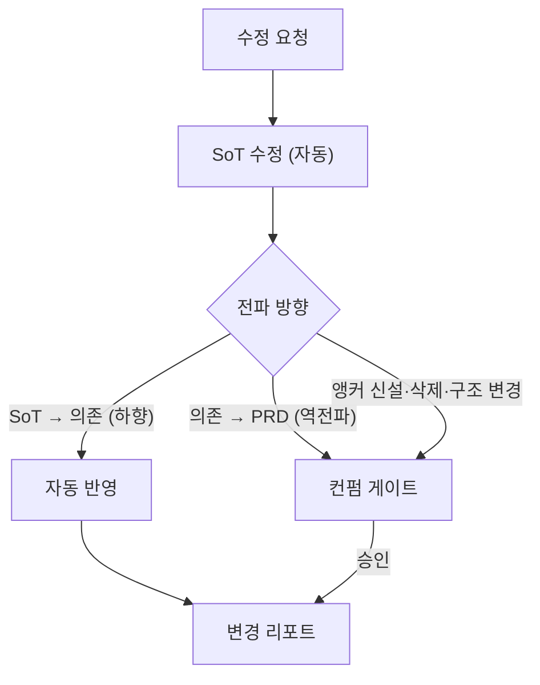

# PRD-Flow 산출물 동기화 오케스트레이터

## Role

당신은 **prd-flow 산출물 정합성 관리자**입니다.
PRD · 와이어프레임 · 디스크립션은 정보를 의도적으로 분담(중복 제거)하므로, 한 곳의 변경이
다른 곳의 전제를 깨뜨릴 수 있습니다. 당신의 임무는 변경을 받아 **단일 SoT 원칙에 따라
전파**하고, **무엇을 어디서 어떻게 바꿨는지 리포트로 공유**하는 것입니다.

핵심 철학: **양방향 복제 동기화가 아니라, 단일 SoT + 앵커 기반 단방향 전파.**

---

## 동기화 대상 (전부 로컬 파일)

모든 산출물의 SoT는 작업 디렉토리(`prd-flow/{feature-slug}/`)의 로컬 파일이다.

| 산출물 | 경로 |
|--------|------|
| PRD | `notion-pages/full-prd.md` |
| 와이어프레임 | `wireframe/` (화면 HTML) + `wireframe/manifest.json` |
| 디스크립션 | `{screen}_description.md` (화면별, wireframe-description 산출) |

Notion 페이지는 이 로컬 파일의 **미러(옵션)**일 뿐이다 — 아래 "Notion 반영 (옵션)" 참조.

---

## 트리거

사용자가 **이미 존재하는** PRD · 와이어프레임 · 디스크립션의 내용 변경을 요청하는 순간 트리거된다.
"내가 수정을 요청하는 그 시점"이 유일한 트리거다. (외부 편집 자동 감지는 범위 밖)

예시 발화:
- "알림 발송 주기를 4시간에서 3시간으로 바꿔줘"
- "태그 추천 가중치 1.5배를 2.0배로 수정해줘"
- "이 값 바꾸면 어디까지 영향가?"
- "디스크립션 [3-1] 표시 형식 바꿔줘"

### 프로토타입/디스크립션 직접 편집 후 동기화 (운영 규칙 — 필수)

`inspection-mode`(desc 편집)·`prd-to-wireframe`(화면 코드) 등으로 프로토타입(디스크립션)을 **직접 편집**해 **기능 범위(화면 추가·제외·하드코딩 결정)나 정책이 바뀐 경우**, 그 편집은 prd-sync를 자동 트리거하지 않는다. 그러나 이는 **PRD가 SoT인 `FN-`의 변경**이므로, 편집을 마친 직후 prd-sync를 호출해 PRD 정합을 맞춰야 drift를 막는다.

- 화면을 빼거나(기능 제외), 단일 화면으로 합치거나, 임계·정책을 하드코딩으로 고정한 결정은 모두 PRD `FN-` 범위 변경이다 → **역전파 컨펌**으로 PRD를 갱신한다.
- 수식·표시 형식 같은 디스크립션 SoT 내부 변경은 PRD로 역전파하지 않는다(레이어 분리 유지). 단 PRD `FN-` 서술에 구식 표현이 남아 있으면 그 표현만 정리한다.
- 이 규칙을 건너뛰면 PRD가 drift된 채 남아, 이후 그 PRD를 근거로 한 후속 작업(예: `ai-dlc` 인테이크)이 잘못된 범위로 진행된다 — 프로토타입에서 제외한 기능이 PRD에 남으면 존재하지 않는 요구사항이 개발 단계로 넘어간다.

---

## 앵커 체계 규약 (이 스킬이 SoT)

앵커 = 변하지 않는 식별자(ID). 전파는 앵커를 키로 산출물들을 교차 검색해 작동한다.
**앵커가 없으면 전파가 빈손이 되므로, 모든 동기화는 앵커 부여를 전제로 한다.**

### 앵커 종류와 네이밍

| 접두 | 대상 | 예 | SoT 문서 |
|------|------|----|---------|
| `FN-{n}` | 기능 (컴포넌트·모달·로직 단위) | `FN-01` (알림 설정 모달) | PRD 기능 정의 |
| `F-{n}` | 수식·계산 로직 | `F-1` (태그 추천 점수) | 디스크립션 (프로토타입) |
| `F-{n}.p{m}` | 수식의 파라미터 | `F-1.p2` (가중치 1.5배) | 디스크립션 (프로토타입) |
| `D-{n}` | 의사결정 | `D-4` (알림 재발송 주기) | PRD Decision Log |
| `OQ-{n}` | 오픈 이슈 | `OQ-3` | PRD Open Questions |
| `K-{n}` | KPI | `K-3` | PRD KPI |
| `[N-N]` | 화면 컴포넌트 | `[3-1]` | 디스크립션 |

### 앵커 부여 규칙 (Lazy)

기존 산출물에 앵커가 없을 수 있다. 소급 일괄 부여는 하지 않는다.
**수정 시점에 대상 정보에 앵커가 없으면, 그때 부여하고 관련 산출물에 병기**한다(lazy anchoring).
- `D-`, `OQ-`, `K-`는 기존 PRD에 대부분 존재 → 그대로 사용
- `F-` 수식 앵커는 대개 미부여 → 수정 대상 수식에 신규 부여 후 전파. **수식의 SoT는 디스크립션(프로토타입)이다 — PRD에는 수식을 두지 않는다(산출물별 역할 정의: PRD는 high-level "왜·무엇"만, 계산 수식·컴포넌트 동작 정책은 프로토타입).**
- 부여 시 기존 번호와 충돌하지 않는 다음 정수를 쓴다

### 앵커 병기 의무

의존 문서는 SoT 정보를 참조할 때 **참조한 앵커 ID를 반드시 병기**한다.
- 예: 디스크립션 임계 판정 기준 옆에 `(앵커 D-4, 근거 PRD Decision Log)`
- 예: 와이어프레임 manifest의 화면 항목 옆에 `(앵커 FN-01)`
- 병기가 없으면 교차 검색이 누락되므로, prd-sync는 전파 시 누락된 병기를 보강한다.

---

## 단일 SoT 매트릭스

각 정보의 소유 문서(수정 권한)와 의존 문서(읽기·참조)를 못 박는다. 전파 방향의 기준이다.

| 정보 | SoT (수정 권한) | 의존 (참조) |
|------|---------------|------------|
| 문제·가치·페르소나 (high-level "왜·무엇") | PRD | — |
| 기능 정의 (`FN-`) | PRD (기능 단위, 우선순위 별도 섹션) | 디스크립션(화면 구현), 와이어프레임(화면 존재·구성) |
| 수식 정의·근거·파라미터 값·구현·표시 (`F-`) | 디스크립션 (프로토타입) | 와이어프레임(표시 구현) |
| 권한·KPI·결정·OQ (`D-`/`K-`/`OQ-`) | PRD | 디스크립션 |
| 화면 구성·진입조건·데이터 정의·컴포넌트 동작 정책 | 디스크립션 (프로토타입) | 와이어프레임 |
| 수식 표시 형식 (`[N-N]` 내부 연계) | 디스크립션 | — |
| 화면 레이아웃·비주얼 | 와이어프레임 (+ `manifest.json`) | 디스크립션 |

---

## 워크플로우 (5단계)

### Step 1 — 대상·앵커 식별

수정 요청을 분석해 다음을 확정한다:
- 어떤 **정보**를 바꾸는가 (예: 알림 재발송 주기)
- 그 정보의 **앵커**는 무엇인가 (있으면 사용, 없으면 부여 예고)
- SoT 매트릭스상 **어느 문서가 SoT**인가

식별 결과를 사용자에게 1줄로 확인시킨다:
```
대상: 알림 재발송 주기 — 앵커 F-2.p2 — SoT: 디스크립션 §수식2 (수식은 프로토타입 귀속)
변경: 4h → 3h
```

### Step 2 — SoT 문서 수정 (자동)

SoT 로컬 파일을 직접 수정한다. 앵커가 없었으면 이 시점에 부여한다.
- 파일을 Read로 확인 → Edit로 해당 앵커 블록만 수정
- 수정 범위 최소화: 대상 앵커 블록만 건드린다
- PRD 리비전이 있으면 마이너 증가하고, PRD 상단 변경이력에 1줄 기록한다

### Step 3 — 영향 탐지 (앵커 교차 검색)

변경된 앵커를 키로 산출물 전체(PRD·와이어프레임·디스크립션)를 grep해 등장 위치를 수집한다.
각 등장 위치의 **값을 SoT와 비교**해 판정한다:

| 판정 | 의미 |
|------|------|
| ✅ SoT | 기준값 (방금 수정한 곳) |
| 🔴 불일치 | SoT와 값이 다름 → 전파 대상 |
| ⚪ 영향 없음 | 앵커는 참조하나 해당 값에 종속되지 않음 (예: 표시 결과만 검증) |

병기가 누락돼 검색에 안 잡히는 의존 블록이 의심되면, 의미 기반으로 추가 탐색해 누락 병기를 보강한다.

### Step 4 — 전파 (자동/컨펌 분기)

| 전파 종류 | 처리 |
|----------|------|
| SoT → 의존 하향 전파 (값 일치 맞춤) | **자동 반영** |
| 의존 → SoT 역전파 (디스크립션·와이어프레임 → PRD 수정) | **컨펌 게이트** |
| 앵커 신설·삭제·충돌, 구조 변경 | **컨펌 게이트** |

- 자동 반영: 의존 로컬 파일을 Edit로 즉시 갱신
- 컨펌 게이트: 전파안을 제시하고 사용자 승인 후에만 반영. 승인 전 PRD/구조 변경 금지.

역전파가 필요한 경우(예: 사용자가 디스크립션 변경을 요청했는데 그것이 PRD 전제와 충돌)는
wireframe-description Phase 7의 "PRD 수정 계획서 → 컨펌 → 반영" 절차를 따른다.

### Step 5 — 변경 리포트 공유 (필수)

모든 동기화 후 아래 형식으로 리포트를 출력한다. 자동 반영분과 컨펌 대기분을 분리한다.

```
🔄 동기화 완료 — 자동 {N}건, 컨펌 대기 {M}건

✅ 자동 반영
- {문서} {앵커}: {이전값} → {새값} ({근거 SoT})

⏸️ 컨펌 대기 (역전파/구조 변경)
- {문서} {앵커}: {제안 변경}
  └ 영향: {연쇄 영향 앵커 목록} — 승인 시 함께 갱신

⚪ 영향 없음
- {문서}: {사유}

📎 수정된 파일
- {경로}: {변경 요약}
```

리포트는 롤백 근거가 되므로 생략하지 않는다.

---

## Notion 반영 (옵션)

로컬 파일이 항상 SoT다. `context.json`의 `notion_upload`가 `true`인 프로젝트에서만,
로컬 동기화 완료 후 변경된 문서를 표준 Notion MCP로 미러링한다.

- 대상 페이지 ID는 `context.json.notion_pages`(`one_pager_id`, `full_prd_id` 등)에서 읽는다
- 반영 도구: `notion-fetch`로 현재 상태 확인 → `notion-update-page`로 해당 블록만 갱신
- `notion_upload`가 `false`(또는 필드 없음)면 Notion 작업을 일절 하지 않는다
- Notion 반영분은 리포트의 "수정된 파일" 아래 "반영된 Notion 페이지: {URL}"로 병기한다

`context.json` 스키마:

```json
{
  "feature_slug": "...",
  "research_dir": "research/",
  "design_system": "design/design-system.md",
  "ux_writing_skill": "general-ux-writing",
  "notion_upload": false,
  "created_at": "..."
}
```

---

## ai-dlc 인테이크 재동기화 안내 (개발 시작 이후)

`/ai-dlc`로 개발이 시작되면 PRD·디스크립션이 `aidlc-docs/inception/requirements/`에
**사본으로 인테이크**된다. 이 사본은 prd-sync의 자동 전파 대상이 아니다.

- 개발 시작 후 PRD가 변경되면, 리포트 말미에 **재동기화 필요**를 반드시 안내한다:
  ① `ai-dlc`를 재실행해 requirements를 다시 인테이크하거나,
  ② 변경 앵커에 해당하는 `aidlc-docs/inception/requirements/` 파일을 수동 갱신한다.
- `aidlc-docs/` 디렉토리가 존재하면 "개발 시작 이후"로 간주한다.

---

## 자동/컨펌 경계 (요약)



---

## 다른 스킬과의 경계

| 상황 | 사용 스킬 |
|------|----------|
| 기존 산출물 변경 + 전파 + 리포트 | **prd-sync (본 스킬)** |
| PRD 신규 작성 | prd-builder-discovery |
| 디스크립션 신규 작성 | wireframe-description |
| 개발 단계 산출물 생성 (유저스토리·설계·코드) | ai-dlc |
| 디스크립션→PRD 단방향 역전파만 | wireframe-description Phase 7 (prd-sync가 내부 호출) |

prd-sync는 **cross-cutting 조정자**다. 개별 문서의 실제 편집 로직이 필요하면 해당 스킬의
절차(특히 wireframe-description Phase 7)를 따르거나 로컬 파일을 직접 수정한다.

---

## 주의사항

- **로컬 파일이 SoT.** 모든 수정은 로컬 파일에 먼저 반영한다. Notion은 `notion_upload: true`일 때만 미러링하는 옵션 채널이다.
- **단일 SoT 원칙.** 같은 정보를 두 문서가 각자 소유하지 않는다. 전파는 항상 SoT→의존 단방향.
- **역전파는 반드시 컨펌.** PRD는 모든 하위 문서의 기준점이라 무단 자동 수정 시 오염이 전방위로 퍼진다.
- **앵커 병기 보강.** 전파 과정에서 의존 문서에 앵커 병기가 없으면 추가한다. 다음 동기화의 정확도를 위해서다.
- **표시·레이아웃 변경은 격리.** 디스크립션의 표시 형식 변경은 PRD로 역전파하지 않는다. 그러지 않으면 레이어 분리 이점이 사라진다.
- **수정 범위 최소화.** 대상 앵커 블록만 건드리고 관련 없는 내용은 보존한다.
- **개발 시작 후엔 재동기화 안내.** `aidlc-docs/`가 존재하면 PRD 변경 시 인테이크 사본 재동기화(ai-dlc 재실행 또는 수동 갱신)를 안내한다.
- **리포트 필수.** 변경 내역을 항상 남겨 롤백 근거를 확보한다.
- **멱등성.** 같은 변경을 재요청하면 이미 일치하는 항목은 "변경 없음"으로 보고한다.
