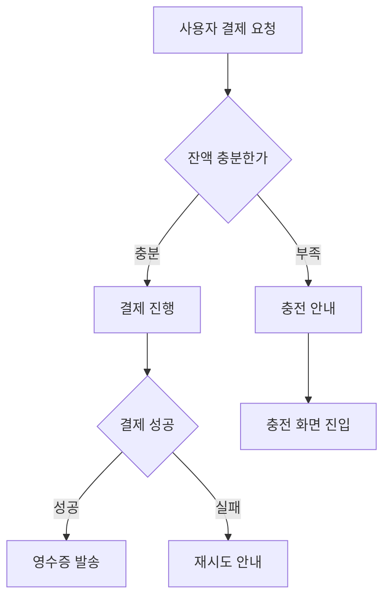
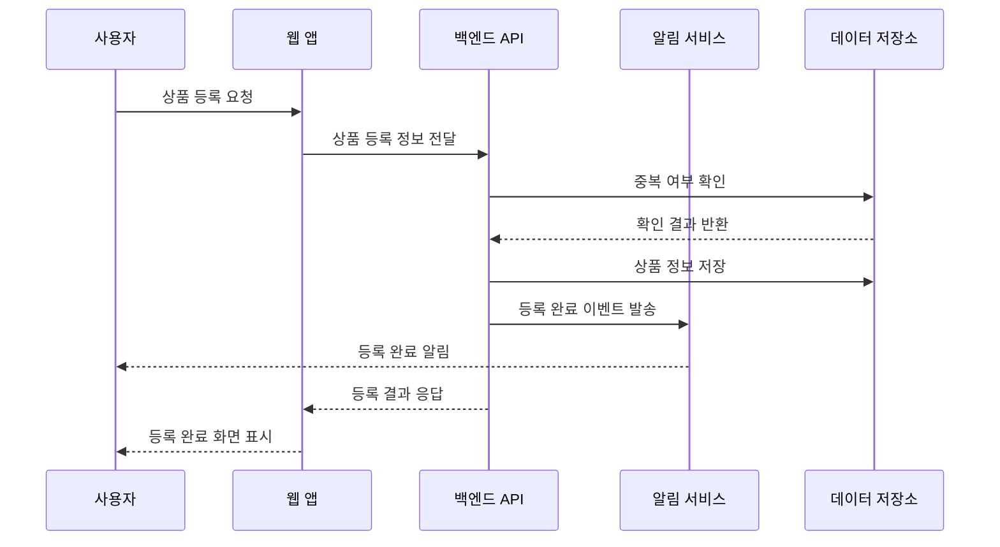
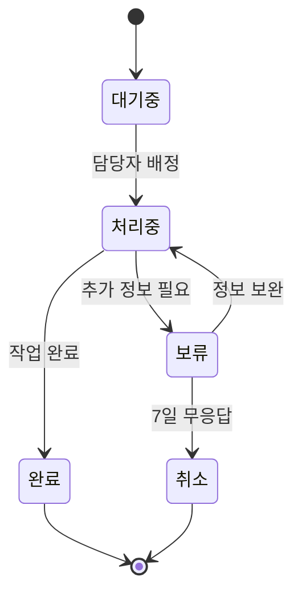
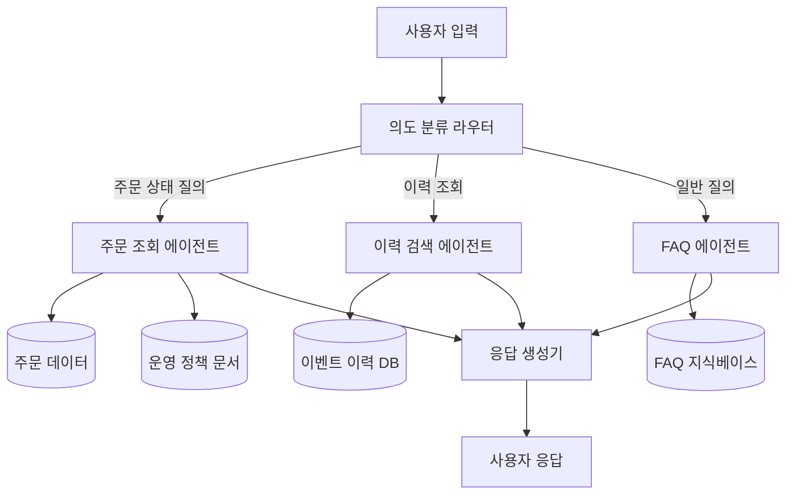
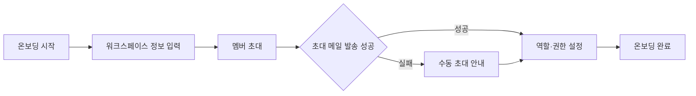
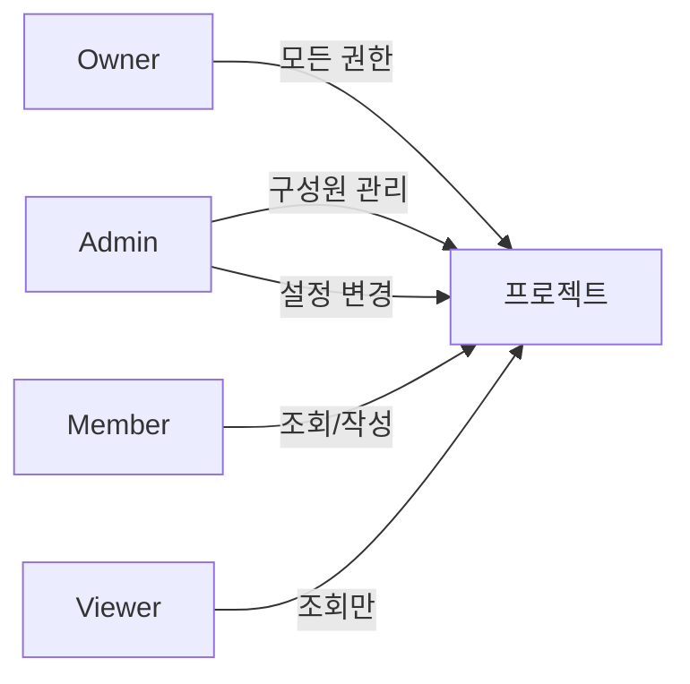

# Mermaid 다이어그램 패턴

비즈니스 로직, 백엔드 시퀀스, AI 에이전트 구성 등은 Mermaid 다이어그램으로 작성한다. Notion이 네이티브 지원하므로 코드 블록만 삽입하면 자동 렌더링된다.

## 1. 비즈니스 로직 분기 (flowchart)

조건 분기, 상태 전환, 의사결정 흐름에 사용.



**작성 원칙**
- 도형 안 텍스트는 명사구 또는 짧은 동사구
- 분기 조건은 의문문 형태 ("잔액 충분한가" / "신뢰도 90% 이상인가")
- 화살표 라벨은 분기 결과 ("충분" / "부족")

## 2. 백엔드 시퀀스 (sequenceDiagram)

시스템 간 호출 흐름. 내부 구현은 블랙박스로 두고 시스템 단위 흐름만 표현.



**작성 원칙**
- participant는 한국어 시스템명 (영문 약어는 별칭으로만)
- 메시지 라벨은 비즈니스 의미 ("상품 등록 정보 전달") — 절대 API 엔드포인트나 메서드명 쓰지 않음
- 응답은 점선 화살표 (`-->>`)
- 노트 박스로 중요한 정책 표시 가능

## 3. 상태 머신 (stateDiagram)

엔티티의 상태 전환 정의. 주문 상태, 티켓 상태, 알림 상태 등.



**작성 원칙**
- 상태명은 한국어 명사
- 전환 라벨은 트리거 이벤트 또는 조건
- 시작/종료는 `[*]`

## 4. AI 에이전트 구성 (graph)

다중 에이전트, 라우터, 서브에이전트 구조 표현. AI 에이전트 사양 작성 시 주로 사용.



**작성 원칙**
- 에이전트는 사각형 `[ ]`
- 데이터 소스는 원통형 `[( )]`
- 라우터/분기는 마름모 `{ }`
- 흐름은 위에서 아래(TB) 또는 왼쪽에서 오른쪽(LR)

## 5. 화면 전환 흐름

사용자가 거치는 화면 시퀀스 표현.



## 6. 권한·역할 매트릭스

표가 더 적합하지만, 관계가 복잡할 때 다이어그램 사용 가능.



## 7. 작성하지 말아야 할 것

❌ **DB 스키마 ERD** — 개발 영역
❌ **클래스 다이어그램** — 개발 영역
❌ **컴포넌트 트리** — 디자이너/개발자 영역
❌ **너무 복잡한 시퀀스** (10단계 초과) — 분할하거나 텍스트로 보완

## 8. Notion에 삽입하는 방법

Notion 페이지에 코드 블록을 만들고 언어를 `mermaid`로 지정하면 자동 렌더링.

```
/code → mermaid 선택 → 다이어그램 코드 입력
```

또는 Notion MCP로 페이지 생성 시 코드 블록 타입을 mermaid로 지정.

## 9. 다이어그램 캡션 작성

모든 다이어그램 위에는 한 줄 설명을 둔다.

```
[다이어그램: 사용자가 상품을 등록하는 흐름]
(mermaid 다이어그램)
```

다이어그램 아래에는 필요 시 보충 설명 (예외 케이스, 정책 참조 등) 을 짧게 추가.
